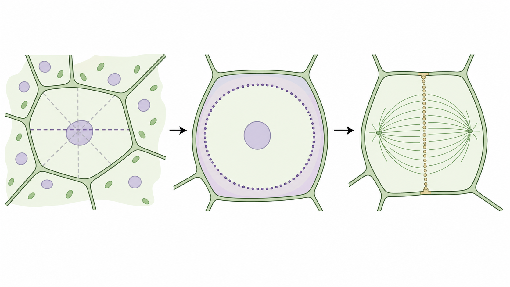
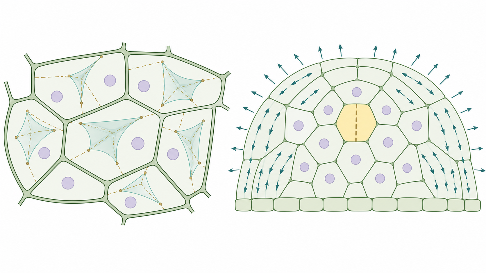
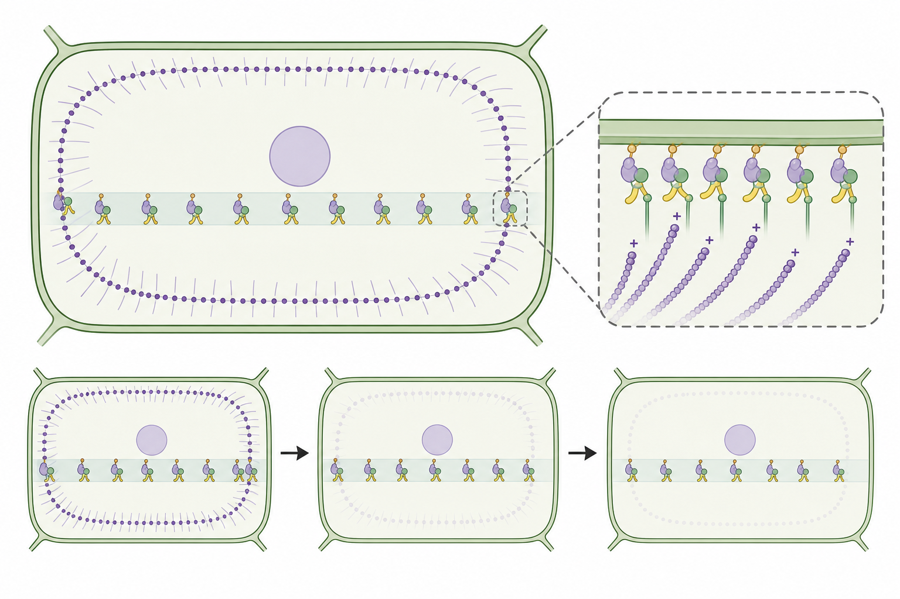
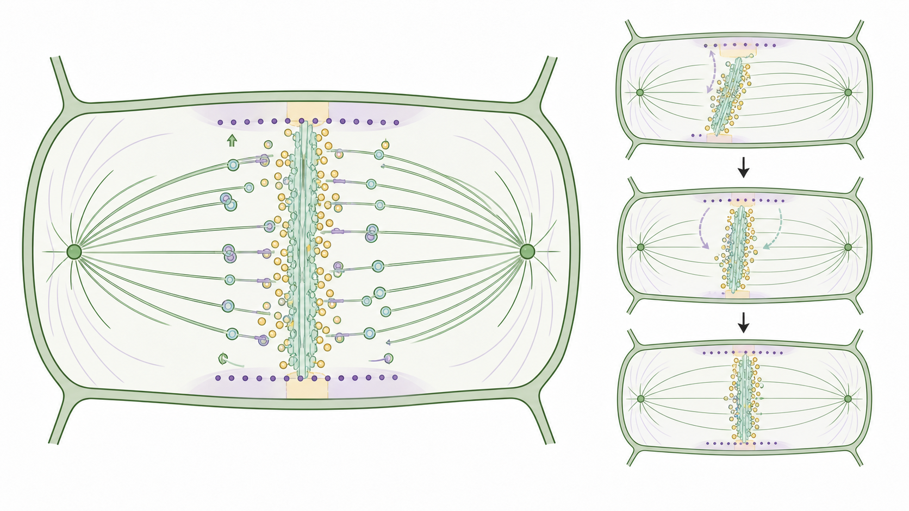
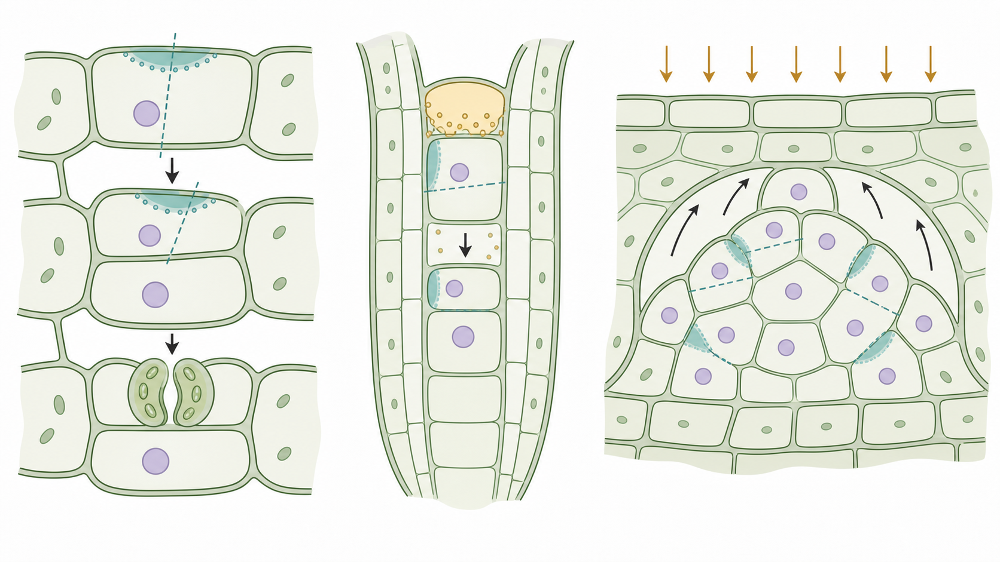
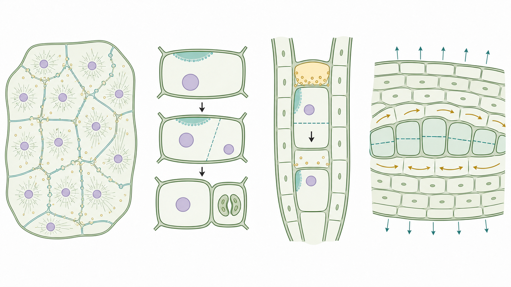

# Preserving Spatial Intent: Canonical and Exceptional Control of the Plant Cell Division Plane

## Abstract
Plant cells cannot rearrange after division in the way many animal cells can; each new wall fixes daughter-cell adjacency, mechanical coupling, and future growth trajectories. Division-plane control is therefore a central morphogenetic decision rather than a late consequence of mitosis. Work across *Arabidopsis thaliana*, maize, tobacco cells, moss, and computational systems now supports a layered model: cell geometry and tissue mechanics nominate possible walls; developmental polarity and fate programs bias or override the geometric default; the preprophase band (PPB) and cortical division zone (CDZ) preserve a cortical address after the visible PPB disappears; and the phragmoplast-cell plate apparatus executes, transports, and corrects the final insertion site. Yet the canonical somatic model is not sufficient. Syncytial endosperm cellularization, pollen and zygote asymmetry, stomatal lineage divisions, root and cambial periclinal divisions, and PPB-poor cytokinetic contexts expose alternative ways to position walls. This review synthesizes classic and recent evidence for both canonical and exceptional division modes. The central unresolved problem is how geometry, mechanics, polarity, cytoskeletal memory, and membrane transport preserve spatial intent when the upstream site-selection logic changes across tissues.

**Keywords:** plant cytokinesis; division plane; preprophase band; cortical division zone; phragmoplast; asymmetric division; cell geometry; plant mechanics

## Introduction: division planes as morphogenetic commitments
Plant development turns a local cytokinetic event into a durable tissue decision. Once a plant cell builds a new wall, the two daughters inherit fixed neighbors and a shared mechanical interface. That interface influences subsequent expansion, lineage topology, symplastic connectivity, and organ form. The placement of the plant cell division plane is therefore not merely a question of where cytokinesis happens; it is a mechanism by which tissues write geometry into development. Classic reviews framed the problem as building new walls in the correct place and coordinating division-plane establishment with cytokinesis [1-4]. Recent syntheses add a stronger temporal dimension: division sites are selected before mitosis, remembered through a period in which the most conspicuous cortical predictor disappears, and then interpreted by an expanding phragmoplast and cell plate [5].

This review develops one thesis: plant division-plane determination is a spatial handoff rather than a linear pathway. A candidate plane is nominated by cell shape, nuclear position, and tissue-scale forces; developmental polarity can bias or veto that candidate; the PPB and CDZ encode the selected site at the cortex; and the phragmoplast-cell plate apparatus executes the decision while retaining some capacity for correction. Nuclear positioning and cell-division site specification are part of this handoff because the nucleus often marks the cytoplasmic geometry through which the future division plane will pass, but nuclear position alone does not explain how a cortical memory persists after PPB disassembly [6].

The evidence hierarchy used here gives priority to direct mechanistic work in *Arabidopsis*, maize, tobacco BY-2 cells, and *Physcomitrium patens*. Computational geometry, mechanical models, and organ-scale studies are used when they explain what direct perturbations cannot isolate. Crop extrapolation is kept cautious: maize provides strong comparative evidence for TAN1-dependent division-site control, whereas most rice, wheat, and barley links remain based on homologs, cellular phenotypes, or organ-level inference rather than direct division-plane mechanisms.

**Table 1. Evidence layers used in this review**

| Evidence layer | Representative systems | Main inference | Limitation |
|---|---|---|---|
| Direct mechanistic genetics and imaging | *Arabidopsis*, maize, tobacco BY-2, *Physcomitrium* | Identifies PPB/CDZ, TAN/POK, phragmoplast, membrane and polarity modules | System-specific cell size and tissue context shape phenotypes |
| Quantitative geometry and mechanics | Embryos, meristems, pavement cells, computational cell surfaces | Defines default candidate planes and tissue-scale bias | Requires perturbation to prove causality |
| Asymmetric division systems | Stomatal lineage, root stem cells, lateral roots | Shows how polarity and fate cues bias geometric defaults | Modules are not always shared across tissues |
| Crop and comparative evidence | Maize TAN1, moss MAP65, cereal organ contexts | Tests conservation and highlights application gaps | Direct mechanistic crop evidence remains sparse |

The expanded literature and open full-text learning used for this version also changed the emphasis of the review. Rather than organizing the topic as a historical progression from PPB discovery to cytokinesis, the manuscript treats division-plane control as an information-preservation problem. A plant cell must preserve spatial intent across a mitotic interval in which cell shape, microtubule arrays, membrane trafficking routes, and cortical protein composition all change. This framing gives equal weight to three questions: how the site is chosen, how it is remembered, and how it is used. It also provides a guardrail against two common overstatements: that the PPB alone determines the plane, or that final wall position alone reveals the original decision.

**Figure 1. A layered handoff model for plant division-plane control.** Geometry, mechanical fields, and developmental polarity first constrain candidate planes. The PPB and CDZ then convert a selected plane into cortical memory. During cytokinesis, the phragmoplast and cell plate interpret that memory and fuse with the parental wall at the target region.

## Defining the decision: candidate plane, cortical memory, and execution
The term “division plane” is often used for three linked but separable events. The first is candidate-plane selection: a premitotic cell chooses a plane through which a new wall is likely to form. The second is cortical memory: a spatial cue at the cell cortex remains after PPB breakdown and marks where the cell plate should meet the parental wall. The third is execution: the phragmoplast, vesicle traffic, and cell plate build and insert the new partition. Separating these events prevents a common logical error. A mutant with an oblique wall may have selected the wrong candidate plane, lost the CDZ after an initially correct PPB, or failed to guide the cell plate to an otherwise correct cortical site [1,3,5].

This distinction also explains why no single structure should be treated as the universal determinant. The PPB is the clearest morphological predictor in many land-plant somatic cells, but its disappearance at nuclear-envelope breakdown means that later cytokinesis must rely on a molecular memory rather than on the original band itself [1,5]. Likewise, the phragmoplast can correct trajectories and respond to cortical targets, yet it does not normally invent the target de novo. A useful framework is therefore a relay with feedback: candidate-plane constraints act before PPB formation; CDZ proteins stabilize the cortical address through mitosis; the phragmoplast and cell plate can reinforce, focus, or reveal failures in that address during cytokinesis.

This relay model sets the standard for evidence. A final wall angle by itself is an insufficient readout because it collapses several events into one endpoint. A stronger experiment follows the same cell through nuclear positioning, PPB appearance, PPB narrowing or broadening, CDZ protein persistence, phragmoplast expansion, cell plate maturation, and wall fusion. If only the final wall is scored, then a defect in early plane choice can be mistaken for a defect in cytokinesis, and a membrane-traffic defect can be misread as a fate-specification phenotype. The most valuable studies therefore combine live imaging, genetics, and quantitative geometry so that the causal layer of the error is visible.

This standard also helps evaluate review claims. A claim about “division-plane establishment” should be supported by evidence before or during PPB/CDZ formation. A claim about “cell plate positioning” should be supported by phragmoplast trajectory, CDZ targeting, or wall-fusion data. A claim about “asymmetric division” should show unequal daughter outcomes or fate differences, not only an oblique wall. These distinctions sound semantic, but they prevent the field from pooling citations at the end of paragraphs that actually support different biological processes.

**Table 2. A modular model of division-plane control**

| Module | Core question | Representative factors or evidence | Working interpretation |
|---|---|---|---|
| Candidate-plane nomination | Which planes are plausible before mitosis? | Cell geometry, nuclear position, tensile stress, organ topology | Provides default options, not a deterministic law |
| Cortical memory | How is the selected site preserved? | PPB, CDZ, POK1/2, TAN, RopGAPs, IQD, CLASP, TON/FASS | Stores spatial intent after PPB breakdown |
| Execution and correction | How does the cell plate reach the target? | MAP65, kinesin-12, myosins, vesicle traffic, phosphoinositides, actin | Builds, guides and corrects the new wall |
| Polarity override | When is the default plane biased? | BASL, POLAR, FEZ/SMB, SHR/SCR-related networks, lateral-root mechanics | Generates formative or asymmetric divisions |

## Geometry and mechanics nominate a default plane
Geometry provides the simplest prior for division-plane selection. In many symmetric divisions, plant cells tend to build short, area-minimizing walls that pass through the cellular interior in a way that produces relatively balanced daughters. Besson and Dumais converted this idea into a quantitative rule for symmetric plant cell division, showing that many observed planes can be understood as minimum-area partitions rather than arbitrary orientations [7]. Tissue mechanics changes the meaning of that default. In *Arabidopsis*, division-plane orientation can be associated with tensile stress, linking local wall mechanics to the direction in which a cell divides [8]. This evidence supports a model in which a cell does not solve a private geometric problem. It divides inside a mechanically coupled tissue, where local wall tension, neighbor geometry, and organ-level growth anisotropy can bias which candidate plane is most stable or developmentally useful.

Three-dimensional analyses refine this view. Early embryo and complex polyhedral cells cannot be interpreted from two-dimensional sections alone, and soap-film minimization can predict division surfaces in realistic cellular geometries [9,10]. The conclusion is not that geometry is a law, but that geometry defines a default solution space whose boundaries can be shifted by mechanical and developmental information.

The geometry-mechanics layer also clarifies why division-plane prediction should be probabilistic. A polyhedral cell may have several candidate walls with similar surface cost, especially when its nucleus, vacuole, and cell walls create a cytoplasmic geometry that is not captured by a simple two-dimensional outline. In such cases, small changes in nuclear position, local wall stiffness, or neighbor-derived stress can shift the ranking of candidate planes without requiring a qualitatively new mechanism. This interpretation fits the observation that developmental perturbations often increase the variance of division orientation before they produce an absolute failure of cytokinesis. A rigorous review of the field therefore needs to distinguish three outputs: the predicted wall surface, the precision with which a population adopts it, and the developmental consequence of deviations from it.

Nuclear position is a particularly useful bridge between geometry and the cytoskeleton. In many dividing plant cells, the nucleus occupies or migrates toward the future division plane before PPB maturation, and cytoplasmic strands can connect nuclear position to the cortex. Yet nuclear position should not be overinterpreted as a master determinant. It can bias the cytoplasmic geometry through which a future wall will pass, but the cortical site still has to be specified, remembered, and later recognized by the phragmoplast [6]. This is why nuclear positioning belongs in the candidate-plane layer rather than replacing the CDZ layer.

**Figure 2. Geometry and mechanics constrain the candidate-plane field.** Area-minimizing surfaces and cell shape define default candidate walls. Tissue-scale tensile fields and local mechanical anisotropy bias which candidate is selected in a growing organ.

Developmental programs can override this default. In *Arabidopsis* embryos, genetic control can produce formative divisions that deviate from geometric predictions and generate tissue layers or different daughter fates [11]. This does not make geometry irrelevant. Rather, it shows that geometry supplies the basal field against which polarity, fate, and mechanical signals act. A division plane that is “non-minimal” may be the correct developmental solution when the task is to create asymmetry, a boundary, or a new stem-cell niche. The mechanistic challenge is to explain how a developmental signal changes the candidate field early enough to reposition the PPB and CDZ, rather than merely changing the fate of daughter cells after cytokinesis.

## The PPB-CDZ module stores spatial intent
The PPB is a plant-specific premitotic cortical array that predicts the future cell plate insertion site. Genetic disruption of PPB formation reduces the robustness of division orientation in plants, showing that the PPB stabilizes spatial information rather than simply decorating a predetermined plane [12]. The key mechanistic question is what remains after the PPB disassembles. The CDZ answers that question: a set of cortical proteins persists at or near the former PPB site through mitosis and cytokinesis, preserving the address to which the phragmoplast must expand [1,5].

POK1 and POK2 are central to this address system. Kinesin-12 proteins translate PPB positional information into a CDZ that guides the approaching phragmoplast, and *pok1 pok2* defects cause severe mispositioning of cell plates and tissue disorganization [13,14]. Recent open full-text work sharpens this model by showing that POK2 polarization depends on premitotic cortical microtubules, electrostatic membrane interactions, and microtubule order, especially when PPB formation is compromised [15]. Biochemical reconstitution further shows that the POK2 tail can interact with microtubules, MAP65-3, and anionic lipids, nominating a cooperative targeting mechanism for retaining POK2 at the future division site [16]. These results move POK proteins from “markers” to molecular bridges that connect microtubules, membrane identity, and phragmoplast guidance.

The POK2 results also change how the PPB should be interpreted. If a kinesin can be delivered to the future site through cortical microtubules and stabilized through membrane and MAP interactions, the PPB is not simply a visible ring that predicts the wall. It is a transient organizing phase that concentrates several classes of spatial information: microtubule geometry, membrane electrostatics, scaffolding interactions, and eventual phragmoplast guidance capacity. This helps explain why PPB-compromised mutants can retain partial division-site information. They may weaken one mode of concentrating the address without eliminating every molecular route by which CDZ residents become polarized.

The same evidence also argues against treating CDZ residents as interchangeable labels. A useful CDZ must preserve at least three properties: position, width, and competence. Position records where the cell plate should fuse. Width determines whether the target is a broad cortical band or a focused insertion zone. Competence describes whether that cortical region can interact productively with phragmoplast microtubules, motors, actin, membrane lipids, and trafficking machinery. Different proteins can contribute to different properties, which explains why some mutants show broad misorientation, others show late cell plate guidance errors, and still others show tissue-level patterning defects despite partial molecular localization.

The width of the cortical target is an underused phenotype. A broad CDZ could still preserve the correct general plane but reduce insertion precision, whereas a narrow but misplaced CDZ would produce consistent but wrong walls. Similarly, a CDZ that retains one marker but loses another may be positionally visible yet functionally incomplete. Future studies should therefore quantify CDZ width, marker co-occupancy, residence time, and relationship to the eventual cell plate fusion line. These measurements would turn the CDZ from a qualitative marker into a measurable memory device.

The CDZ is broader than POK. Putative RopGAPs interact with POK1 and influence division-plane selection, suggesting that ROP-related signaling contributes to the cortical state [17]. TANGLED identifies the division plane through mitosis and cytokinesis in *Arabidopsis*, and its localization can occur through several mechanisms [18,19]. In maize, TAN1 interacts with microtubules and supports division-plane positioning, while recent work shows de novo TAN1 recruitment to aberrant cell plate fusion sites, implying that the execution layer can feed information back to the cortical marker system [20,21]. Myosin VIII and Myosin XI add an actomyosin component: Myosin VIII associates with microtubule ends and actin in division guidance, and the PPB can recruit Myosin XI to the cortical division site to guide phragmoplast expansion [22,23].

**Figure 3. The PPB-CDZ transition converts a predicted plane into cortical memory.** PPB microtubules mark the future insertion zone before mitosis. CDZ proteins such as POK, TAN, ROP-related factors, IQD proteins, and myosins preserve and interpret that address after PPB disassembly.

PPB formation and microtubule organization require upstream cortical cytoskeleton regulators. IQ67 DOMAIN proteins facilitate PPB formation and division-plane orientation [24]. CLASP controls cortical microtubule behavior at cell edges and contributes to expansion and division phenotypes [25,26]. TONNEAU1 proteins and the TONNEAU2/FASS PP2A-related module are essential for normal PPB and cortical microtubule organization [27,28]. These factors show that the PPB is not a standalone ring. It emerges from a premitotic cortical cytoskeleton whose geometry, edge behavior, and membrane-associated scaffolding determine how accurately a future site is encoded.

This layered view provides a practical way to read mutant phenotypes. A broad or unstable PPB points to a defect in candidate-plane consolidation. Loss of CDZ residents after a normal PPB points to a memory defect. A correct CDZ with a wandering cell plate points to an execution or guidance defect. Mixed phenotypes are expected because several proteins occupy more than one layer. POK2, for example, belongs to the CDZ but also appears in the phragmoplast midzone, while myosins and actin-associated pathways can affect both cortical targeting and later expansion. Treating these as layered functions, rather than as contradictions, makes the literature more coherent.

## Execution is active: phragmoplast expansion, membrane traffic, and correction
The division plane is only fulfilled when the cell plate fuses with the parental wall at the correct cortical site. The phragmoplast is the execution apparatus: antiparallel microtubules, actin, motors, and membrane traffic organize vesicles at the midzone and expand centrifugally. MAP65 proteins stabilize antiparallel microtubule overlaps and maintain phragmoplast bipolarity. In *Physcomitrium patens*, MAP65 is essential for phragmoplast bipolarity and cell plate formation, while AtMAP65-3/PLE is required for cytokinetic phragmoplast function in *Arabidopsis* [29,30]. Live analysis of phragmoplast expansion supports the idea that the execution layer is self-organizing and dynamic, not a passive ruler laid over a preselected plane [31].

The membrane component is equally important. Classic ultrastructural models described higher-plant cytokinesis as vesicle fusion and cell-plate maturation at the division plane [32]. Later work showed that endocytosed proteins can be rerouted from recycling to secretion to reach the division plane, linking cytokinesis to membrane trafficking decisions [33]. Recent studies extend this execution layer. Class II kinesin-12 can facilitate cell plate formation by transporting cell plate materials in the phragmoplast [34]. Phosphatidylinositides regulate the morphological transition of the *Arabidopsis* cell plate, with PI4P, PI(4,5)P2, phosphatidylserine dynamics, and DRP1A recruitment contributing to successful cytokinesis [35]. ER-plasma membrane interactions and SCAR/WAVE-dependent actin recruitment also support cytokinesis, reinforcing that cell plate insertion is coordinated with membrane contact sites and actin organization [36].

**Figure 4. The phragmoplast-cell plate apparatus executes and corrects wall insertion.** Vesicle traffic, membrane remodeling, MAP65-stabilized microtubules, kinesin activities, and actin-associated factors coordinate cell plate growth toward a cortical target zone.

Vesicle regulators help convert cytoskeletal guidance into a new wall. Rab GTPases, tethers, and SNAREs act together during *Arabidopsis* cell plate formation, providing a trafficking framework for delivery and fusion [37]. Four-dimensional lattice light-sheet microscopy has also made cell-plate development measurable as a sequence of robust transition points rather than a single endpoint [38]. These advances matter for division-plane research because they expose intermediate failure modes. A final oblique wall may result from a wrong PPB, a weak CDZ, mistimed vesicle delivery, membrane-lipid defects, or phragmoplast expansion that fails to correct a tilt.

The execution layer therefore has its own spatial logic. Phragmoplast microtubules do not only carry vesicles; they organize the geometry of where vesicles accumulate, where membrane tubules mature, and where the expanding cell plate contacts the cortex. Membrane lipids and trafficking proteins do not only supply material; they tune the physical state of the developing plate so that it can pass from a tubulovesicular network to a planar partition. Actin and ER-PM contacts do not only provide generic support; they influence how cytokinetic membranes and cytoskeletal arrays remain coordinated. These mechanisms are downstream of division-site selection, but they can still determine whether the selected site is faithfully used.

This point is important for interpreting new high-resolution cytokinesis data. If a study detects a defect in cell plate morphology, vesicle fusion, or lipid composition, the immediate phenotype may be incomplete cytokinesis rather than wrong division-plane choice. However, such defects still matter for plane fidelity when they change where or how the cell plate reaches the cortex. The correct evidence wording is therefore conditional: membrane and trafficking factors demonstrate execution-layer control of cytokinesis, and they support division-plane fidelity when their perturbation changes the match between the cell plate and the CDZ.

## Polarity and asymmetric division bias the same machinery
Asymmetric and formative divisions do not require a separate conceptual framework. They use the same general handoff but alter the weights upstream of the PPB-CDZ system. Reviews of plant divisions that deviate from the shortest symmetric path and of asymmetric division-site determination emphasize that geometry can be biased by polarity, fate regulators, and local tissue context [39,40]. Thus, asymmetric division is not an exception to division-plane control; it is a stress test of the model.

The stomatal lineage illustrates this principle. BASL forms a cortical polarity domain and controls asymmetric cell division in *Arabidopsis*, creating daughters with different fates [41]. POLAR-guided signaling complex assembly links polarity to signaling during asymmetric division, helping spatialize MAPK-related outputs [42]. These data show how an off-center cortical domain can bias the candidate plane before cytokinesis executes it. The critical point is that polarity does not bypass the cytoskeleton; it biases where the cytoskeletal and cortical memory machinery should operate.

Root tissues provide a second entry point. FEZ and SOMBRERO control the orientation of division planes in *Arabidopsis* root stem cells, connecting transcriptional state to formative division orientation [43]. JACKDAW and MAGPIE delimit asymmetric division and stabilize tissue boundaries by restricting SHORT-ROOT action [44]. Lateral root development adds mechanics: the properties of overlying tissues influence morphogenesis, and recent synthesis links division orientation with cell shape during lateral root initiation [45,46]. These systems show that division-plane control integrates fate information, mechanical constraints, and organ topology.

The shared logic across these examples is not a shared polarity protein, but a shared architectural problem. A formative division must place a new wall where it changes cell adjacency in a useful way. In the stomatal lineage, that means producing a smaller meristemoid and a larger sister cell. In the root stem-cell niche, it means renewing a stem-cell pool while generating a differentiated lineage. In lateral root initiation, it means coordinating new divisions with the mechanical resistance of overlying tissues. The upstream cues differ, but each system must still translate a biased candidate plane into a cortical address and then into an executed wall.

This is where asymmetric division can inform symmetric division. Polarity systems make the bias explicit and experimentally visible, whereas symmetric divisions often hide their bias behind a geometric default. If a polarity crescent can shift the PPB/CDZ system off center, then a weaker mechanical or geometric bias may use the same downstream machinery in a less obvious way. Conversely, if a downstream CDZ or phragmoplast component fails, both symmetric and asymmetric divisions should suffer, but the phenotype may be easier to diagnose in a system where the expected off-center plane is known.

**Figure 5. Developmental polarity biases candidate-plane choice.** Stomatal lineage cells, root stem-cell files, and lateral-root primordia illustrate how local polarity domains, fate regulators, and mechanical boundaries can bias or override geometric defaults while still relying on cortical memory and cytokinetic execution.

## Comparative systems and crop-facing gaps
The strongest mechanistic base remains *Arabidopsis*, but comparative systems prevent the field from mistaking one model for a universal implementation. Maize TAN1 work shows that division-site factors identified in *Arabidopsis* have conserved relevance in a large-celled grass context [20,21]. *Physcomitrium* MAP65 work shows that phragmoplast microtubule organization is a useful comparative window into a conserved execution module [29]. Tobacco BY-2 cells continue to support high-resolution cytological analysis of cell plate formation and phragmoplast dynamics, although their cultured context limits direct developmental inference [1,32].

Crop-facing evidence is more limited. Rice, wheat, barley, and other cereals contain homologs of several division-plane and cytokinesis regulators, and organ architecture in grasses depends strongly on oriented divisions in leaves, roots, vascular tissues, and meristems. Yet homolog expression or organ shape alone does not demonstrate a division-plane mechanism. Direct crop progress will require live imaging, tissue-specific perturbation, and quantitative wall-insertion phenotypes in developmental contexts where cell files and organ topology can be measured. Until then, maize TAN1 and selected rice root-meristem studies should be treated as entry points rather than proof that all cereal architecture traits can be explained through known *Arabidopsis* modules.

This caution is especially important for translational claims. Division orientation is often invoked to explain organ width, root radial patterning, vascular organization, or stomatal patterning, but a breeding-relevant trait can change for many reasons: altered cell proliferation rate, anisotropic expansion, hormone transport, wall mechanics, or fate specification. A division-plane mechanism should be claimed only when wall insertion angle, daughter-cell geometry, and tissue topology are measured directly. Otherwise, the safer wording is that a gene or pathway nominates a possible connection between cytokinesis and organ architecture.

The practical route into crops is therefore not to search for one conserved “division-plane gene,” but to define measurable conversion points. A maize or rice homolog can be considered a strong candidate when it localizes to a PPB/CDZ-like cortical region, changes wall insertion angles in a tissue-specific manner, and produces a predictable topological output without simply reducing cell viability. A stronger case would combine perturbation with live imaging or lineage reconstruction. This standard is demanding, but it prevents the field from translating elegant cell-biology mechanisms into broad crop claims before the causal chain has been tested.

## Toward predictive models of division-plane control
A predictive model must distinguish where errors enter the handoff. Post-embryonic plant organs can show local rules and self-organizing properties in cell division patterns [47]. At the shoot apical meristem, local mechanical control can generate global topological order [48]. These results imply that a model limited to single-cell geometry will miss tissue-level feedback. Conversely, a model limited to tissue mechanics will miss polarity domains and CDZ memory. The next generation of models should combine cell shape, nuclear position, mechanical anisotropy, cortical polarity, PPB quality, CDZ persistence, phragmoplast trajectory, and final wall insertion.

The measurement problem is becoming tractable. Four-dimensional imaging can separate cell plate initiation, expansion, maturation, and fusion into quantifiable phases [38]. Protein dynamics can now be related to membrane lipids, cytoskeletal motors, and trafficking regulators [15,16,34-37]. Mechanical stress also patterns cortical microtubule behavior in pavement cells and can contribute to tissue-level order in the shoot apical meristem [48,49]. The most useful experiments will perturb one layer while measuring the others: for example, weakening PPB formation while quantifying POK2 polarization and phragmoplast correction, altering mechanical stress while tracking CDZ width, or biasing polarity while testing whether vesicle-traffic defects change the final wall insertion site. Such designs would move the field from cataloging markers toward causal allocation.

A useful prediction from the handoff model is that different perturbations should leave different signatures. A geometry perturbation should shift the distribution of candidate planes before PPB formation. A memory perturbation should uncouple an apparently normal PPB from later CDZ residency. An execution perturbation should leave the predicted site intact but alter phragmoplast trajectory, expansion speed, membrane maturation, or fusion precision. A polarity perturbation should change where the PPB/CDZ system is placed in a tissue-specific way. Testing these signatures would let the field assign causality more cleanly than scoring final wall angles alone.

The model also predicts useful interaction tests. If geometry and polarity act upstream of the CDZ, then weakening CDZ memory should reduce the reproducibility of both symmetric and asymmetric divisions. If membrane lipids or vesicle regulators act mainly at the execution layer, then their strongest defects should appear after a recognizable site has already been selected. If mechanical stress influences candidate ranking, then experimentally changing tissue tension should alter PPB orientation before cytokinesis begins. These predictions are deliberately falsifiable; they are meant to separate layers that are often discussed together.

## Exceptional division modes reveal the limits of the canonical model
The PPB-CDZ-phragmoplast framework is most powerful for many somatic cells, but it becomes incomplete when the cell is not a single walled unit choosing one wall. The expanded full-text literature highlights several special modes that should be treated as mechanistic probes rather than curiosities. Syncytial endosperm cellularization, pollen and microspore asymmetry, zygote and embryo formative divisions, stomatal lineage divisions, root patterning divisions, cambial periclinal divisions, and some PPB-poor cytokinetic contexts each ask a different version of the same question: how is a wall positioned when the upstream site-selection logic does not look like a canonical equatorial PPB in a typical somatic cell?

**Endosperm cellularization as a noncanonical division-site problem.** Endosperm is the most important special case for a review of plant division-plane control because early endosperm development often begins as a syncytium. Multiple nuclei divide in a shared cytoplasm before cellularization partitions the cytoplasm into domains. The problem is therefore not one cell choosing one wall. It is a spatial coordination problem in which nuclear cytoplasmic domains, radial cytoskeletal arrays, anticlinal wall fronts, and later periclinal partitions must generate a tissue from a multinucleate cytoplasm. Classic ultrastructural work in *Arabidopsis* described syncytial-type cell plates as a distinct kind of cell plate involved in endosperm cellularization, making clear that the cell plate logic in endosperm cannot be reduced to ordinary somatic cytokinesis [50].

Endosperm cellularization is unusual because the first walls often arise between nuclear domains and can form irregular, incomplete, or expanding fronts. This creates a different definition of a “division site.” In a somatic cell, the site is usually a cortical band where one new wall will fuse. In syncytial endosperm, the site can be a boundary between neighboring nuclear cytoplasmic domains, a cellularization front, or a later wall that subdivides an already compartmentalized region. Cytoskeletal work in higher-plant endosperm showed dynamic F-actin during interphase, mitosis, and cytokinesis, supporting the view that actin organization is integral to this multinuclear cellularization context [51]. Studies of endosperm and endosperm-placenta syncytia in bladderworts further emphasize that microtubule arrangement in syncytia can be organized around unusual domain architectures rather than a single PPB-like cortical ring [52].

The biological meaning of “irregular” is also different in endosperm. In a proliferating epidermis or root file, an irregular wall often signals a failure to preserve tissue order. In endosperm, irregularity may be part of the normal transition from a free-nuclear or syncytial phase to a cellular tissue. Nuclear domains can be spaced unevenly, cytoplasmic streams can move around a large central vacuole, and wall fronts can meet at nonstandard angles as cellularization proceeds. A review that treats every nonorthogonal wall as a division-plane defect would therefore misread endosperm development. The more appropriate metric is whether cellularization boundaries partition nuclear domains, connect to the correct maternal or peripheral interfaces, and generate functional endosperm subdomains.

The regulatory layer of endosperm cellularization also differs from canonical somatic division. In *Arabidopsis*, auxin regulates endosperm cellularization, linking a hormone gradient and parent-of-origin-dependent seed programs to the timing of wall formation [53]. Transcriptomic analysis during endosperm cellularization and embryo differentiation shows that the cell-wall formation phase is coupled to a broader developmental program rather than to cytokinesis alone [54]. In maize, VKS1 regulates mitosis and cytokinesis during early endosperm development, giving a cereal example in which mitotic progression and cytokinetic organization are directly tied to seed development [55]. These studies suggest that endosperm cellularization is governed by a hybrid logic: cytoskeletal execution modules are reused, but the upstream decision is set by syncytial nuclear spacing, developmental timing, and seed-specific hormonal and epigenetic programs.

The distinction between dicot and cereal endosperm matters here. *Arabidopsis* endosperm provides a compact system for studying fertilization-triggered nuclear proliferation, auxin-dependent timing, and cellularization failure in hybridization barriers. Cereal endosperm adds a larger, agronomically important tissue in which early mitosis, cellularization, endoreduplication, aleurone specification, transfer-cell identity, and starchy endosperm filling are coupled. The cereal problem is not only how walls form, but how early divisions and cellularization establish compartments that later support storage metabolism. Thus, cereal endosperm should not be used merely as an application example; it is a distinct spatial system in which division-site control, cell-cycle transitions, and grain-filling programs intersect.

This exceptional mode changes the review's central model. In endosperm, “candidate plane” should be replaced by “candidate cellularization boundary.” “Cortical memory” may be less useful than “domain boundary memory,” because relevant boundaries can lie between nuclei before a complete cellular cortex exists. “Execution” still depends on cell plate-like membrane and wall deposition, but the geometry of execution is distributed across many nuclei. A deep review should therefore not simply add endosperm as another tissue example. It should treat endosperm cellularization as a stress test of the canonical model: which components of plant cytokinesis are portable to a syncytium, and which depend on a pre-existing walled cell with a cortex?

**Figure 6. Exceptional plant division modes expose alternative wall-positioning logic.** Syncytial endosperm cellularization coordinates walls around many nuclei; asymmetric lineages bias a wall through polarity domains; root or embryo formative divisions use fate and niche cues; cambial or lateral-root contexts combine periclinal divisions with tissue mechanics. These modes reuse parts of the cytoskeletal and membrane execution machinery but differ in how the wall site is nominated.

**Pollen, microspores, and male germline asymmetry.** Male gametophyte development provides another special case because asymmetric division is coupled to lineage specification in a highly reduced cell lineage. Reviews of the angiosperm male germline emphasize that an inconspicuous lineage can still execute tightly patterned divisions that produce vegetative and generative or sperm-cell identities [56]. Microspore and pollen divisions are not merely smaller versions of root or leaf cell divisions. They occur in cells with strong polarity, changing nuclear position, and a developmental objective of separating germline and supportive functions. The wall site is therefore tied to cell fate partitioning at the gametophyte scale. This makes pollen a useful comparison to stomatal asymmetry: both generate unequal daughters, but the tissue context, downstream fate logic, and mechanical constraints differ.

**PPB-poor, reproductive, and coenocytic cytokinesis.** A separate class of special cases is defined less by asymmetry than by the absence or reduced usefulness of a canonical somatic PPB. Endosperm cellularization is one example, but reproductive cytokinesis and some early-diverging or coenocytic systems also force the cell to coordinate membrane and wall deposition without the same premitotic cortical landmark used in typical somatic cells. These cases shift attention from “where was the PPB?” to “what spatial scaffold replaces or bypasses the PPB?” In some systems, nuclear position and radial microtubule systems provide the scaffold; in others, meiotic or gametophytic programs impose a division sequence. The portable part of the model is the execution machinery: phragmoplast-like arrays, vesicle fusion, actin, and cell plate maturation remain central. The variable part is how the site is nominated before membrane deposition begins [32,50,56].

**Zygote and early embryo asymmetry.** The zygote is another case where the division plane is inseparable from developmental polarity. In *Arabidopsis*, the receptor kinase ZAR1 is required for zygote asymmetric division and daughter-cell fate, demonstrating that an upstream signaling component can affect both division geometry and fate partitioning [57]. Early embryo studies also show that geometry can predict many divisions, but formative divisions can override geometric expectations when tissue layers or lineage differences must be established [9-11]. The zygote-to-embryo transition therefore links nuclear migration, polarity axis establishment, cell elongation, and wall placement. It should be treated as a developmental-polarity problem that uses cytokinetic execution, not as a neutral geometric problem.

**Stomatal and grass epidermal asymmetry.** Stomatal lineage divisions are the best-developed model for polarity-biased asymmetric division in somatic tissues. BASL and POLAR-related pathways show how a cortical polarity domain can bias division and daughter fate [41,42]. In grasses, subsidiary mother cells and stomatal complexes add a spatially constrained epidermal context in which neighboring cells orient divisions relative to guard mother cells. Maize OPAQUE1/DISCORDIA2, a myosin XI, is required for phragmoplast guidance during asymmetric cell division, reinforcing that grass epidermal systems are not only polarity systems but also tests of whether the execution layer can follow a biased site accurately [58]. The distinction matters: a polarity mutant may choose the wrong site, whereas a phragmoplast-guidance mutant may choose a site but fail to reach it.

**Root, cambial, and lateral-organ periclinal divisions.** Root stem cells, cortex/endodermis patterning, lateral roots, and cambial tissues extend the special-division logic into organ architecture. FEZ/SOMBRERO and SHORT-ROOT/SCARECROW-related networks show that fate and boundary signals regulate formative divisions in roots [43,44]. Lateral root initiation links division orientation to the mechanical properties of overlying tissues [45,46]. Cambial and other periclinal divisions add a tissue-layering problem: the new wall is often oriented to maintain a radial file or generate a new tissue layer rather than to minimize wall area. These divisions should be grouped not by one shared protein module but by their shared developmental job: they place walls to build or maintain tissue stratification.

**What special divisions add to the general model.** The special cases reveal four portable principles. First, the execution machinery is broadly reusable: phragmoplasts, vesicle traffic, actin, and cell plate maturation recur across many contexts. Second, upstream site nomination is plastic: it can be driven by geometry, polarity, nuclear spacing, hormone timing, fate domains, or mechanical constraints. Third, memory may be cortical, domain-based, or tissue-pattern-based depending on whether a normal cortex exists before wall formation. Fourth, final wall position is a poor standalone diagnostic. In endosperm, an irregular wall front may be normal cellularization; in a stomatal lineage it may be a fate-patterning error; in a cambial file it may disrupt tissue stratification. A mature review of plant division-plane control therefore needs a taxonomy of division modes, not only a canonical pathway.

This taxonomy also suggests how to compare special divisions without flattening them. The first axis is cellular architecture: single walled cell, polarized gametophyte cell, multinucleate syncytium, or layered tissue. The second axis is the source of bias: geometry, mechanics, polarity, fate, nuclear spacing, or developmental timing. The third axis is the memory device: PPB/CDZ, polarized cortical domain, nuclear cytoplasmic domain, tissue boundary, or phragmoplast-associated feedback. The fourth axis is the output: equal daughters, unequal daughters, cellularization compartments, new tissue layers, or lineage boundaries. Mapping each division type onto these axes gives a more useful synthesis than listing tissues one by one.

**Table 3. Special plant division modes and the site-selection problem they expose**

| Division mode | Site-selection problem | Main cues | What differs from canonical somatic PPB-CDZ cytokinesis |
|---|---|---|---|
| Syncytial endosperm cellularization | Partition many nuclear cytoplasmic domains into cellular compartments | Nuclear spacing, syncytial cytoskeleton, auxin/timing, seed programs | Boundary nomination occurs before normal cellular walls exist |
| Pollen and microspore asymmetric division | Separate germline and vegetative/supportive identities | Nuclear position, polarity, gametophytic fate programs | Fate partitioning dominates over tissue geometry |
| Zygote and embryo formative division | Establish apical-basal and tissue-layer lineages | Polarity axis, receptor kinase signaling, embryo geometry | Developmental polarity can override minimal-wall defaults |
| Stomatal lineage and grass epidermis | Generate unequal daughters and patterned epidermal neighbors | BASL/POLAR-like polarity, neighbor cues, phragmoplast guidance | Polarity and execution accuracy must be distinguished |
| Root and cambial periclinal division | Build or maintain tissue layers and radial files | SHR/SCR-related fate domains, mechanical boundaries, organ topology | New walls serve tissue stratification rather than local symmetry |

## Outlook
Plant cell division-plane control is best understood as a layered spatial handoff. Geometry and mechanics nominate plausible walls; polarity and fate programs bias the choice; PPB and CDZ proteins preserve a cortical memory; phragmoplast expansion, membrane traffic, and cell plate maturation execute and correct insertion. The framework explains why PPB disruption can reduce robustness without abolishing cytokinesis, why asymmetric divisions can deviate from minimal-wall rules without being erroneous, and why phragmoplast guidance factors can have tissue-level consequences.

Three bottlenecks remain. The measurement bottleneck is the lack of cross-tissue four-dimensional datasets that simultaneously capture candidate-plane selection, PPB/CDZ dynamics, and cell plate trajectories. The mechanism bottleneck is how cortical memory is molecularly stabilized after PPB disassembly, especially through POK/TAN/ROP/myosin/lipid interactions. The translation bottleneck is that crop architecture is often discussed in terms of cell division orientation, but direct mechanistic tests in crops are scarce. Resolving these bottlenecks will require experimental designs that treat division-plane control as an information-transfer problem across scales, not as the property of one cytoskeletal structure.

The immediate opportunity is to turn the handoff model into an assay design. A minimal experiment would record the nucleus, PPB, at least two CDZ markers, phragmoplast geometry, cell plate membrane state, and final wall insertion in the same living tissue. A stronger experiment would combine that imaging with a perturbation that targets only one layer, such as mechanical stress, PPB assembly, POK/TAN retention, membrane lipid remodeling, or polarity domain formation. Such designs would make it possible to say not only that a wall is misplaced, but why the spatial intent failed.

## Outstanding Questions
1. How are candidate planes ranked when cell geometry, nuclear position, mechanical stress, and developmental polarity conflict in the same cell?
2. What is the minimal molecular system that maintains a functional CDZ after PPB disassembly?
3. How do POK, TAN, ROP-related regulators, myosins, membrane lipids, and actin cooperate without collapsing into a single linear pathway?
4. Which phragmoplast behaviors represent active correction, and which simply reveal earlier defects in candidate-plane selection or CDZ memory?
5. Are asymmetric divisions in stomatal lineages, root stem cells, embryos, and lateral roots variations of one polarity-to-CDZ logic or tissue-specific solutions?
6. Which division-plane mechanisms are conserved in grasses, and which are specific to *Arabidopsis* cell size, tissue geometry, or developmental timing?
7. Can four-dimensional imaging and mechanical perturbation predict the next division plane before PPB formation?
8. What validation threshold is needed before a division-plane mechanism can be linked to crop architecture or breeding-relevant organ traits?

## References
1. Livanos, P. & Müller, S. Division Plane Establishment and Cytokinesis. *Annual Review of Plant Biology* **70**, 239-267 (2019).
2. Rasmussen, C. G., Humphries, J. A. & Smith, L. G. Determination of Symmetric and Asymmetric Division Planes in Plant Cells. *Annual Review of Plant Biology* **62**, 387-409 (2011).
3. Rasmussen, C. G., Wright, A. J. & Müller, S. The role of the cytoskeleton and associated proteins in determination of the plant cell division plane. *The Plant Journal* **75**, 258-269 (2013).
4. Smith, L. G. Plant cell division: building walls in the right places. *Nature Reviews Molecular Cell Biology* **2**, 33-39 (2001).
5. Bouchez, D., Uyttewaal, M. & Pastuglia, M. Spatiotemporal regulation of plant cell division. *Current Opinion in Plant Biology* **80**, 102530 (2024).
6. Hazelwood, O. S., Orr, J. M. & Ashraf, M. A. Nuclear positioning and cell division site specification in plants. *Journal of Experimental Botany* https://doi.org/10.1093/jxb/eraf241 (2025).
7. Besson, S. & Dumais, J. Universal rule for the symmetric division of plant cells. *Proceedings of the National Academy of Sciences USA* **108**, 6294-6299 (2011).
8. Louveaux, M., Julien, J. D., Mirabet, V., Boudaoud, A. & Hamant, O. Cell division plane orientation based on tensile stress in *Arabidopsis thaliana*. *Proceedings of the National Academy of Sciences USA* **113**, E4294-E4303 (2016).
9. Moukhtar, J. et al. Cell geometry determines symmetric and asymmetric division plane selection in Arabidopsis early embryos. *PLoS Computational Biology* **15**, e1006771 (2019).
10. Martínez, P. F. et al. Predicting Division Planes of Three-Dimensional Cells by Soap-Film Minimization. *The Plant Cell* **30**, 2255-2266 (2018).
11. Yoshida, S. et al. Genetic Control of Plant Development by Overriding a Geometric Division Rule. *Developmental Cell* **29**, 75-87 (2014).
12. Schaefer, E. et al. The preprophase band of microtubules controls the robustness of division orientation in plants. *Science* **356**, 186-189 (2017).
13. Lipka, E. et al. The Phragmoplast-Orienting Kinesin-12 Class Proteins Translate the Positional Information of the Preprophase Band to Establish the Cortical Division Zone in *Arabidopsis thaliana*. *The Plant Cell* **26**, 2617-2632 (2014).
14. Müller, S., Han, S. & Smith, L. G. Two Kinesins Are Involved in the Spatial Control of Cytokinesis in *Arabidopsis thaliana*. *Current Biology* **16**, 888-894 (2006).
15. Livanos, P., Kriechbaum, C., Remers, S., Herrmann, A. & Müller, S. Kinesin-12 POK2 polarization is a prerequisite for a fully functional division site and aids cell plate positioning. *Nature Communications* https://doi.org/10.1038/s41467-025-58852-w (2025).
16. Leong, S. Y. et al. The tail domain of the plant kinesin-12 POK2 is a versatile interaction hub. *Journal of Cell Science* https://doi.org/10.1242/jcs.263785 (2025).
17. Stöckle, D. et al. Putative RopGAPs impact division plane selection and interact with kinesin-12 POK1. *Nature Plants* **2**, 16120 (2016).
18. Walker, K. L., Müller, S., Moss, D., Ehrhardt, D. W. & Smith, L. G. Arabidopsis TANGLED Identifies the Division Plane throughout Mitosis and Cytokinesis. *Current Biology* **17**, 1827-1836 (2007).
19. Rasmussen, C. G., Sun, B. & Smith, L. G. Tangled localization at the cortical division site of plant cells occurs by several mechanisms. *Journal of Cell Science* **124**, 270-279 (2010).
20. Martínez, P. F. et al. TANGLED1 mediates microtubule interactions that may promote division plane positioning in maize. *Journal of Cell Biology* **219**, e201907184 (2020).
21. Uyehara, A. N. et al. *De novo* TANGLED1 recruitment from the phragmoplast to aberrant cell plate fusion sites in maize. *Journal of Cell Science* **137**, jcs262097 (2024).
22. Wu, S. Z. & Bezanilla, M. Myosin VIII associates with microtubule ends and together with actin plays a role in guiding plant cell division. *eLife* **3**, e03498 (2014).
23. Huang, C. H., Peng, F., Lee, Y. R. J. & Liu, B. The microtubular preprophase band recruits Myosin XI to the cortical division site to guide phragmoplast expansion during plant cytokinesis. *Developmental Cell* **59**, 1586-1600.e6 (2024).
24. Kumari, P. et al. IQ67 DOMAIN proteins facilitate preprophase band formation and division-plane orientation. *Nature Plants* **7**, 739-747 (2021).
25. Ambrose, C., Allard, J. F., Cytrynbaum, E. N. & Wasteneys, G. O. A CLASP-modulated cell edge barrier mechanism drives cell-wide cortical microtubule organization in Arabidopsis. *Nature Communications* **2**, 430 (2011).
26. Ambrose, C., Shoji, T., Kotzer, A. M., Pighin, J. A. & Wasteneys, G. O. The *Arabidopsis CLASP* Gene Encodes a Microtubule-Associated Protein Involved in Cell Expansion and Division. *The Plant Cell* **19**, 2763-2775 (2007).
27. Azimzadeh, J. et al. *Arabidopsis* TONNEAU1 Proteins Are Essential for Preprophase Band Formation and Interact with Centrin. *The Plant Cell* **20**, 2146-2159 (2008).
28. Camilleri, C. et al. The Arabidopsis TONNEAU2 Gene Encodes a Putative Novel Protein Phosphatase 2A Regulatory Subunit Essential for the Control of the Cortical Cytoskeleton. *The Plant Cell* **14**, 833-845 (2002).
29. Kosetsu, K., de Keijzer, J., Janson, M. E. & Goshima, G. MICROTUBULE-ASSOCIATED PROTEIN65 Is Essential for Maintenance of Phragmoplast Bipolarity and Formation of the Cell Plate in *Physcomitrella patens*. *The Plant Cell* **25**, 4479-4492 (2013).
30. Müller, S. et al. The Plant Microtubule-Associated Protein AtMAP65-3/PLE Is Essential for Cytokinetic Phragmoplast Function. *Current Biology* **14**, 412-417 (2004).
31. Murata, T. et al. Mechanism of microtubule array expansion in the cytokinetic phragmoplast. *Nature Communications* **4**, 1967 (2013).
32. Staehelin, L. A. & Hepler, P. K. Cytokinesis in Higher Plants. *Cell* **84**, 821-824 (1996).
33. Richter, S. et al. Delivery of endocytosed proteins to the cell-division plane requires change of pathway from recycling to secretion. *eLife* **3**, e02131 (2014).
34. Yamada, M. et al. Class II kinesin-12 facilitates cell plate formation by transporting cell plate materials in the phragmoplast. *Nature Plants* https://doi.org/10.1038/s41477-025-01909-x (2025).
35. Luo, Y., Tian, Y. F., Liu, H. R. & Yang, W. C. Phosphatidylinositides regulate the cell plate morphology transition during cytokinesis in Arabidopsis. *Nature Communications* https://doi.org/10.1038/s41467-025-62067-4 (2025).
36. Xu, Z. et al. The ER-PM interaction is essential for cytokinesis and recruits the actin cytoskeleton through the SCAR/WAVE complex. *Proceedings of the National Academy of Sciences USA* https://doi.org/10.1073/pnas.2416927122 (2025).
37. Shi, Y., Luo, C., Xiang, Y. & Qian, D. Rab GTPases, tethers, and SNAREs work together to regulate *Arabidopsis* cell plate formation. *Frontiers in Plant Science* **14**, 1120841 (2023).
38. Sinclair, R. et al. Four-dimensional quantitative analysis of cell plate development in Arabidopsis using lattice light sheet microscopy identifies robust transition points between growth phases. *Journal of Experimental Botany* https://doi.org/10.1093/jxb/erae091 (2024).
39. Serra, L. & Robinson, S. Plant cell divisions: variations from the shortest symmetric path. *Biochemical Society Transactions* **48**, 2825-2834 (2020).
40. Yi, P. & Goshima, G. Division site determination during asymmetric cell division in plants. *The Plant Cell* **34**, 2129-2142 (2022).
41. Dong, J., MacAlister, C. A. & Bergmann, D. C. BASL Controls Asymmetric Cell Division in Arabidopsis. *Cell* **137**, 1320-1330 (2009).
42. Houbaert, A. et al. POLAR-guided signalling complex assembly and localization drive asymmetric cell division. *Nature* **563**, 574-578 (2018).
43. Willemsen, V. et al. The NAC Domain Transcription Factors FEZ and SOMBRERO Control the Orientation of Cell Division Plane in Arabidopsis Root Stem Cells. *Developmental Cell* **15**, 913-922 (2008).
44. Welch, D. et al. *Arabidopsis* JACKDAW and MAGPIE zinc finger proteins delimit asymmetric cell division and stabilize tissue boundaries by restricting SHORT-ROOT action. *Genes & Development* **21**, 2196-2204 (2007).
45. Lucas, M. et al. Lateral root morphogenesis is dependent on the mechanical properties of the overlying tissues. *Proceedings of the National Academy of Sciences USA* **110**, 5229-5234 (2013).
46. Winter, Z., Bellande, K. & Vermeer, J. E. M. Divided by fate: The interplay between division orientation and cell shape underlying lateral root initiation in Arabidopsis. *Current Opinion in Plant Biology* **74**, 102370 (2023).
47. von Wangenheim, D. et al. Rules and Self-Organizing Properties of Post-embryonic Plant Organ Cell Division Patterns. *Current Biology* **26**, 439-449 (2016).
48. Jackson, M. D. B. et al. Global Topological Order Emerges through Local Mechanical Control of Cell Divisions in the Arabidopsis Shoot Apical Meristem. *Cell Systems* **8**, 53-65.e3 (2019).
49. Sampathkumar, A. et al. Subcellular and supracellular mechanical stress prescribes cytoskeleton behavior in Arabidopsis cotyledon pavement cells. *eLife* **3**, e01967 (2014).
50. Otegui, M. S. & Staehelin, L. A. Syncytial-Type Cell Plates: A Novel Kind of Cell Plate Involved in Endosperm Cellularization of Arabidopsis. *The Plant Cell* **12**, 933-947 (2000).
51. Schmit, A. C. & Lambert, A. M. Characterization and dynamics of cytoplasmic F-actin in higher plant endosperm cells during interphase, mitosis, and cytokinesis. *Journal of Cell Biology* **105**, 2157-2166 (1987).
52. Płachno, B. J., Świątek, P., Sas-Nowosielska, H. & Kozieradzka-Kiszkurno, M. Organisation of the endosperm and endosperm-placenta syncytia in bladderworts (*Utricularia*, Lentibulariaceae) with emphasis on the microtubule arrangement. *Protoplasma* **250**, 863-873 (2013).
53. Batista, R. A., Figueiredo, D. D., Santos-González, J. & Köhler, C. Auxin regulates endosperm cellularization in *Arabidopsis*. *Genes & Development* **33**, 466-476 (2019).
54. Li, C., Hu, F., Chen, H. & Zhao, J. Transcriptome characteristics during cell wall formation of endosperm cellularization and embryo differentiation in *Arabidopsis*. *Frontiers in Plant Science* **13**, 998664 (2022).
55. Huang, Y. et al. Maize VKS1 Regulates Mitosis and Cytokinesis During Early Endosperm Development. *The Plant Cell* **31**, 1238-1256 (2019).
56. Russell, S. D. & Jones, D. S. The male germline of angiosperms: repertoire of an inconspicuous but important cell lineage. *Frontiers in Plant Science* **6**, 173 (2015).
57. Yu, T. Y. et al. The Arabidopsis Receptor Kinase ZAR1 Is Required for Zygote Asymmetric Division and Its Daughter Cell Fate. *PLoS Genetics* **12**, e1005933 (2016).
58. Nan, Q. et al. The OPAQUE1/DISCORDIA2 myosin XI is required for phragmoplast guidance during asymmetric cell division in maize. *The Plant Cell* **35**, 2678-2693 (2023).

