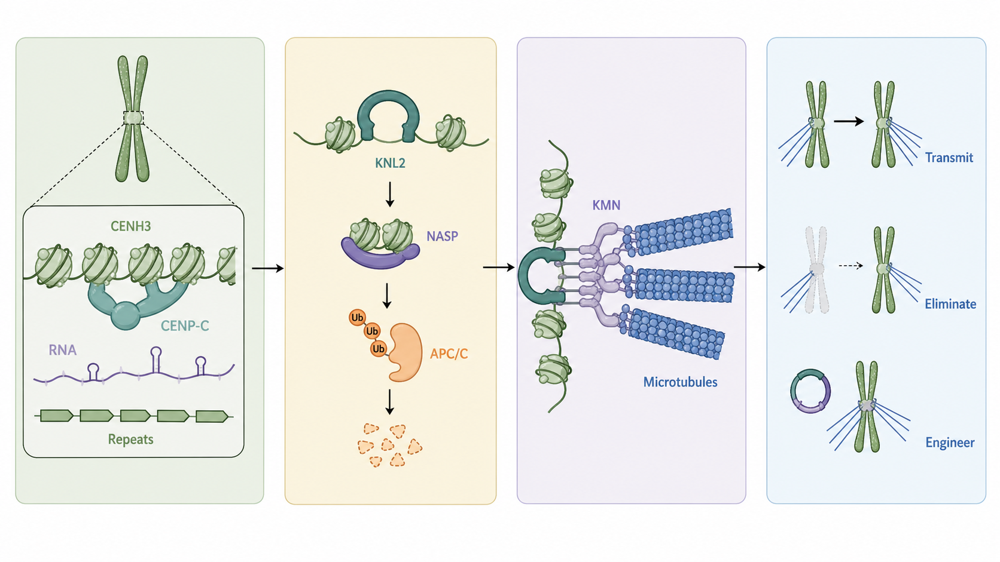
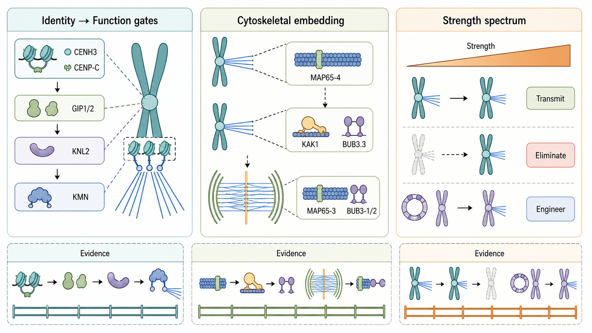
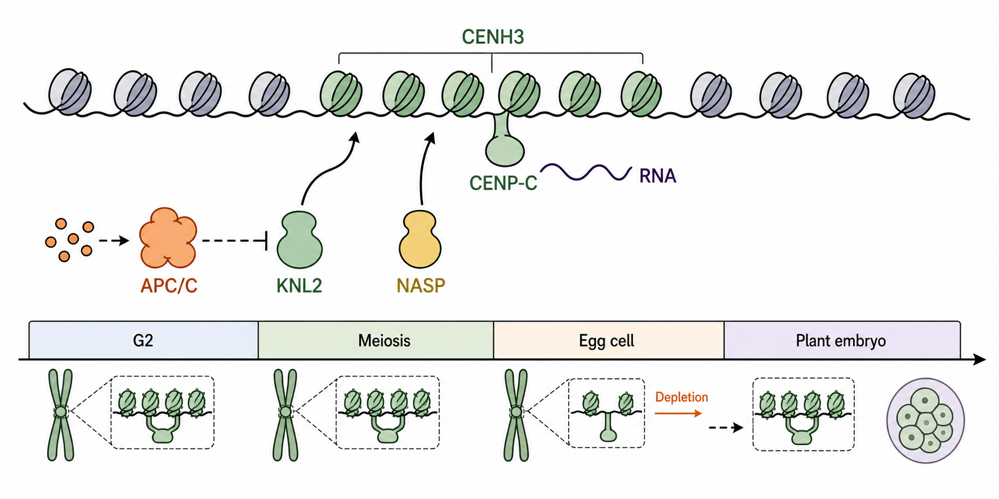
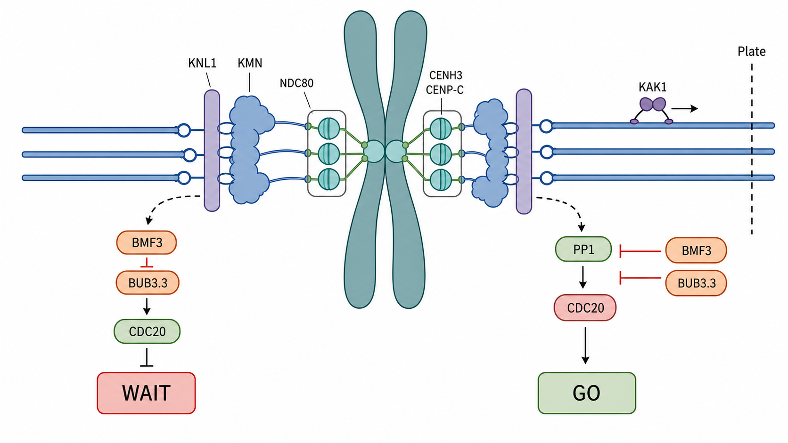
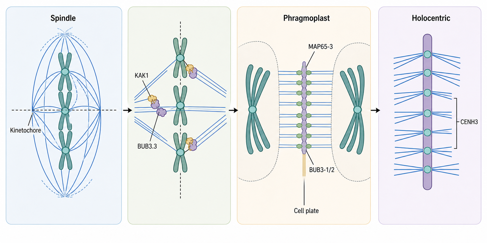
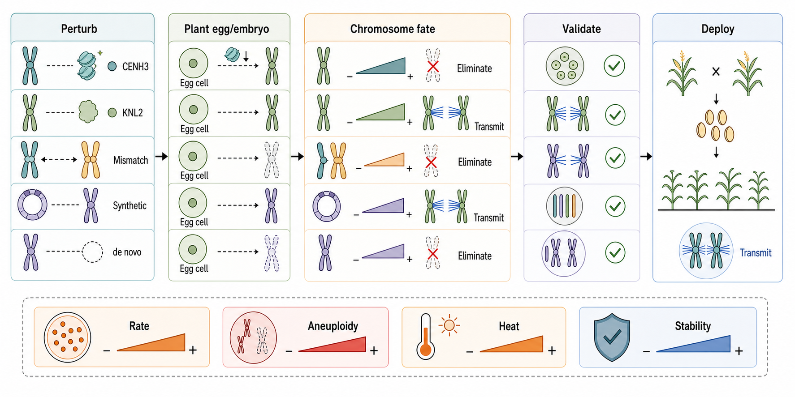

# Plant kinetochores: tuning centromere strength for chromosome fate

**Abstract**

Plant kinetochores convert centromere chromatin into microtubule attachment, checkpoint control, and heritable chromosome behavior. A gated model of kinetochore strength now links repeat dynamics, marker localization, and chromosome transmission. CENH3 and CENP-C define an inner platform, centromeric transcripts and retrotransposons tune its chromatin context, KNL2 and histone chaperones control CENH3 loading, the KMN network creates the attachment interface, and checkpoint proteins convert attachment state into cell-cycle decisions. Recent Arabidopsis work links KNL1, BMF3/BUB3.3, and the kinetochore-associated kinesin KAK1 to plant-specific chromosome congression, placing kinetochores within the cytoskeletal logic of acentrosomal spindle assembly and phragmoplast-based cytokinesis. The evidence spans *Arabidopsis thaliana*, maize, rice, barley, rye-related materials, and holocentric plants. The central tension is that centromere DNA evolves quickly, while segregation requires a heritable and mechanically reliable kinetochore. CENH3-mediated haploid induction, synthetic maize centromeres, KNL2 manipulation, egg-cell CENH3 depletion, and de novo centromere formation show that plant kinetochores can be rewired. Their deployment is constrained by kinetochore strength, developmental timing, parental asymmetry, environmental sensitivity, and cross-generation stability. Strength-based thinking connects these mechanisms to predictive crop-scale chromosome engineering across diverse crops.

**Keywords:** plant kinetochore; centromere identity; CENH3; spindle checkpoint; chromosome engineering

## The Centromere-Function Gap

Plant kinetochores sit at a narrow and consequential interface: they preserve chromosome identity across mitotic and meiotic divisions while remaining responsive to attachment errors and reproductive resetting. A centromere has cytological, genomic, epigenetic, and functional meanings: primary constriction, repeat-rich or structurally distinct chromosomal domain, CENH3-containing chromatin, and the region that builds a kinetochore competent for microtubule attachment. These definitions overlap imperfectly. In plants, rapidly evolving centromere DNA, repeat-rich crop genomes, and holocentric lineages expose the gap between centromere position and kinetochore function. Recent reviews of plant kinetochores and centromeres have shifted from static centromere position to a functional question: which molecular gates decide whether a chromosomal region becomes a heritable, force-bearing kinetochore [1-3]?

CENH3 signals and microtubule-binding patches describe parts of the plant kinetochore. The complete assembly is a protein-nucleic-acid machine that reads centromere chromatin, recruits an outer attachment interface, monitors incorrect attachments, and changes behavior in meiosis, plant embryogenesis, and engineered chromosome systems. Many plant cases violate a one-to-one model. CENH3-rich chromatin can diverge from the full region of spindle attachment in holocentric systems. Repeats can be abundant at a centromere without supporting kinetochore function. A weakened centromere can segregate in one context and be eliminated after fertilization; a chromosome fragment can acquire a de novo centromere if chromatin and cell-cycle conditions favor productive assembly.

Plant kinetochores operate as gated interfaces. The first gate is centromere identity: CENH3, CENP-C, centromeric RNA, satellite repeats, retrotransposons, and local chromatin states create a probabilistic platform for assembly. The second gate is CENH3 loading and maintenance: KNL2, histone chaperones, post-translational modification, and proteolysis restrict where and when centromeric nucleosomes are deposited. The third gate is outer-kinetochore assembly: NDC80, MIS12-associated proteins, KNL1, and related factors convert inner identity into a microtubule-coupled interface. The fourth gate is surveillance and reset: spindle assembly checkpoint proteins, phosphatases, chromosomal passenger components, cohesin, and meiotic regulators decide whether attachment is accepted, delayed, corrected, or deliberately altered.

*Arabidopsis thaliana* provides genetics, cell-cycle timing, embryo studies, and recent checkpoint work. Maize provides large-kinetochore cytology, CENH3/CENP-C/NDC80 evidence, centromere RNA, artificial chromosome systems, and haploid-induction engineering. Rice and barley reveal centromere organization in large crop genomes and separate centromere function from any single repeat family. Holocentric plants such as *Luzula* and *Cuscuta* test whether CENH3 distribution, spindle attachment, and chromosome geometry can be decoupled. Crop engineering studies then ask whether these mechanisms can be controlled well enough to produce haploids, synthetic chromosomes, or stable introgression materials.

Long-read genome assemblies and improved cytological markers are changing what can be asked. Earlier plant centromere studies often had to infer function from repeat enrichment, immunostaining in a few tissues, or segregation phenotypes after large chromosomal rearrangements. Current work can combine chromosome-scale assemblies, CENH3 or CENP-C profiling, protein localization, mutant genetics, and transmission assays. That combination exposes a recurring mismatch: the genomic region that looks like a centromere, the chromatin region that carries CENH3, and the region that recruits a microtubule-coupled outer kinetochore may overlap without being equivalent. The mismatch defines the biological space in which centromere repositioning, genome elimination, and synthetic centromere formation become possible.

Kinetochore biology becomes difficult to interpret when marker proteins, DNA repeats, chromosome behavior, and breeding applications are treated as equivalent readouts. CENH3 immunolocalization supports centromere identity without proving checkpoint competence. KNL1 or NDC80 localization supports outer-kinetochore assembly more directly. Haploid induction demonstrates a transmission bias while leaving the causal molecular defect unresolved. Separating these readouts makes plant kinetochore studies interpretable as a coherent mechanism (Figure 1).

**Figure 1. Gated centromere identity and chromosome fate at plant kinetochores.** Centromere chromatin identity, CENH3 loading, KMN-mediated microtubule attachment, and chromosome outcomes are separated as linked decision points. A CENH3-marked chromosomal region gains functional significance only when assembly, attachment, surveillance, and inheritance readouts converge.

## Three Themes: Gates, Cytoskeleton, Strength

Three organizing principles sharpen the mechanism. First, centromere identity and kinetochore function are coupled and separable. CENH3 and CENP-C mark the inner platform, while GIP1/GIP2, KNL2, NDC80, KNL1, and checkpoint factors add successive licensing steps toward full attachment competence [4-11]. CENH3 enrichment alone supports centromere identity; outer assembly and checkpoint readouts strengthen functional claims.

Second, the plant kinetochore is a cytoskeletal hub embedded in a plant-specific division program. MAP65-4 associates with Arabidopsis kinetochore fibers and promotes microtubule-bundle elongation [12], KAK1 cooperates with BUB3.3 to regulate chromosome congression [13], and BUB3-1/2 acts with MAP65-3 at the phragmoplast midline during cytokinesis [14]. Moss kinetochore-protein depletion can also uncouple chromosome segregation from cytokinesis and produce somatic polyploidization [15]. These related and distinct modules show that plant chromosome segregation is shaped by acentrosomal spindle self-organization and by the handoff from metaphase mechanics to phragmoplast-based cytokinesis.

Third, kinetochore strength is relative, developmental, and selectable. The same biology can support stable transmission, genome elimination, or synthetic centromere inheritance depending on CENH3 dosage, assembly-factor timing, parental mismatch, microtubule attachment, and plant-embryo selection. CENH3 or KNL2 perturbation matters when the altered centromere state falls within a predictable strength window (Figure 2).

**Figure 2. Three organizing themes for plant kinetochore biology.** Centromere identity passes through function gates, kinetochore behavior is embedded in plant-specific microtubule systems, and kinetochore strength influences chromosome transmission, elimination, and engineering.

## Measuring Function Across Readouts

The first bottleneck in plant kinetochore research is a measurement problem. Centromere identity, kinetochore assembly, microtubule attachment, chromosome movement, checkpoint signaling, and inheritance stability are measured with different assays. A CENH3 ChIP-seq peak, a CENP-C immunostaining signal, an NDC80 focus, a metaphase alignment defect, and a haploid-induction phenotype are all informative; each reports a different part of the system. The strongest conclusions come from studies that combine them.

Inner-centromere markers define the most widely used entry point. CENH3 is the plant centromeric histone H3 variant, and its centromeric localization in *A. thaliana* helped establish an epigenetic view of plant centromere identity [16]. Maize showed that CENH3 interacts with CentC satellite repeats and centromeric retroelements, linking CENH3 chromatin to specific repeat environments without reducing centromere identity to those sequences [17]. CENP-C adds a second inner-kinetochore component. In maize, a CENP-C homolog is a constitutive inner kinetochore component [18]. Together, CENH3 and CENP-C define an inner platform whose attachment competence depends on outer assembly and surveillance.

Centromere-encoded RNA and CENP-C binding refine this boundary. Maize centromere-encoded RNAs were found as integral components of the kinetochore [19], and CENP-C DNA binding can be stabilized by single-stranded RNA [20]. Centromeric transcription and RNA-protein interactions tune inner-platform stability and separate repeat enrichment from functional centromere status. Without alignment among RNA state, CENH3 deposition, and CENP-C binding, repetitive DNA may remain a sequence feature with limited kinetochore-forming capacity.

Outer-kinetochore markers sit closer to function. NDC80 is the best-known microtubule-binding interface in many eukaryotes, and maize NDC80 is a constitutive feature of the central kinetochore [4]. Arabidopsis SPC24 and NUF2 homolog studies show that NDC80-complex components affect cell division, spindle organization, chromosome segregation, and development [21-22]. More recent work argues that KNL1 and NDC80 are practical universal markers for detecting functional centromeres in plants [23]. A 2025 affinity-purification and structural-prediction study then defined a broader Arabidopsis KMN complex, identifying thirteen proteins and supporting deep conservation of outer-kinetochore organization with plant-specific local variation [5]. This distinction matters in difficult systems: a CENH3 signal can mark centromeric chromatin, while KNL1/NDC80 and associated KMN signals better indicate outer-kinetochore assembly.

Checkpoint readouts measure surveillance. A plant cell can assemble kinetochore proteins and still fail to delay anaphase after incorrect attachment. Prolonged checkpoint signaling can indicate unresolved attachment even with intact centromere identity. Early live-cell work on plant spindle assembly checkpoint proteins established that checkpoint components show conserved and plant-adapted dynamics during cell division [24]. Recent work in Arabidopsis and maize has connected KNL1, BMF3/BUB3.3, CDC20, and phosphatase recruitment to spindle assembly checkpoint signaling and silencing [6-10]. The circuitry centers on how a plant kinetochore switches from "wait" to "go" once microtubule occupancy and tension reach acceptable thresholds.

The assay map remains explicit. CENH3 ChIP or immunostaining is strongest for locating centromeric chromatin. CENP-C strengthens the inference that the inner kinetochore is assembled. KNL1, NDC80, NUF2, and SPC24-family markers provide stronger evidence for an outer kinetochore. Live-cell or staged cytology of alignment, lagging chromosomes, and anaphase bridges reports the mechanical output of the attachment interface. Checkpoint protein localization or delayed anaphase reports surveillance. Genetic transmission, haploid induction, and multigeneration stability report the final inheritance outcome. When a paper combines one or two readouts, the claim stays readout-specific. A CENH3-rich neocentromere candidate requires outer markers and segregation behavior before it can be treated as a fully validated functional kinetochore.

This hierarchy is critical in large crop genomes, where repeats can mislead both assembly and annotation. A tandem repeat family enriched near the primary constriction may be an informative landmark, yet it may fall outside the active CENH3 domain. Active genes or low-copy sequences inside a centromere remain compatible with kinetochore function, as rice centromere studies have shown [25]. For crop genomics, the safest operational definition of a functional centromere is convergent: chromosome-scale sequence context, CENH3 and CENP-C occupancy, outer-kinetochore marker recruitment, and stable transmission. The more engineered or rearranged the chromosome, the more this convergence matters.

Inheritance stability is the final and most stringent readout. A kinetochore that functions in one mitosis may still be unstable over meiosis, fertilization, embryo development, or multiple generations. This issue is central to plant chromosome engineering. CENH3-based haploid inducers, artificial maize centromeres, and de novo centromeres succeed when altered kinetochore behavior produces predictable transmission with limited random chromosome loss. Functional plant kinetochore studies gain strength by connecting four measurements: inner identity, outer assembly, checkpoint behavior, and inheritance. Very few systems currently satisfy all four, which is why evidence-ranked wording remains necessary.

## CENH3 Loading Turns Sequence Into State

The strongest conceptual shift in plant centromere research is that centromere DNA is informative and insufficient. Plant centromeres frequently contain satellite repeats and centromere-targeted retrotransposons, yet those elements vary rapidly and can be absent from stable functional chromosomes. Barley chromosomes without typical centromeric repeats can still be stable [26], and rice centromere sequencing revealed active genes within a functional centromere [25]. Sequence contributes by creating a local chromatin environment that can favor or disfavor CENH3 nucleosome maintenance, CENP-C binding, transcription, and recombination suppression. Function emerges from the interaction between sequence and epigenetic state.

The sequence-epigenetic interaction is visible at several scales. At the nucleosome scale, CENH3 replaces canonical H3 in centromeric chromatin and provides a heritable mark that is read by inner kinetochore proteins. At the domain scale, satellite repeats and retrotransposons can concentrate CENH3-compatible chromatin and help maintain a repeat-rich centromeric environment. At the chromosome scale, long arrays of repeats, structural variants, and DNA methylation shape recombination landscapes and centromere-proximal inheritance. T2T-era Arabidopsis centromere work shows cycles of satellite and transposon evolution [27], while structural variation and DNA methylation influence centromere-proximal meiotic crossover frequency [28]. A 2025 Nature study further showed that a centrophilic retrotransposon integrates into CENH3-occupied Arabidopsis centromere regions, supporting CENH3 chromatin as a guide for rapid repeat turnover and as a substrate shaped by repeats [29]. The centromere is a dynamic domain that protects segregation while also shaping genetic exchange.

The rapid evolution of centromeric DNA creates a paradox. Segregation requires a stable cellular address, yet the sequence content of that address changes across species and even among accessions. One resolution is that plant cells inherit a chromatin state over a precise sequence string. Repeats and retrotransposons can support that state by nucleating local chromatin environments, and they remain replaceable over evolutionary time. A chromatin-state model explains why centromeric repeats can expand or contract without immediately destroying chromosome transmission. The kinetochore reads a chromatin and protein context biased by sequence.

The first mechanistic gate is CENH3 deposition. In *A. thaliana*, CENH3 loading occurs mainly during G2 and requires the histone fold domain [30]. During meiosis, CENH3 loading has a distinct reproductive timing [31]. These direct plant data constrain any engineering model that treats CENH3 abundance as a simple input. CENH3 needs the right cell-cycle stage, chromatin context, and retention across chromosome reorganization. A centromere that is adequate in mitotic tissues may behave differently in male or female meiosis, after fertilization, or in early embryogenesis (Figure 3).

KNL2 provides a second gate upstream of CENH3. Arabidopsis KNL2 is required for normal CENH3 deposition at centromeres [32], and its centromere targeting depends on a conserved CENPC-k motif in the C terminus [33]. Plant KNL2 has undergone recurrent plant-specific duplications while retaining a conserved function as a kinetochore assembly factor [34]. The duplication pattern suggests that plants preserve the CENH3-loading gate while allowing lineage-specific variation in how it is implemented.

Histone chaperones and protein turnover sharpen the gate. NASP contributes to de novo deposition of CENH3 in Arabidopsis early embryogenesis [35], and APC/C-CDC20-driven KNL2 proteolysis is critical for centromere integrity and mitotic fidelity [36]. Centromere identity depends on recruitment, removal, timing, and dosage. Low CENH3 weakens kinetochore identity; poorly restricted loading could create ectopic assembly potential or blur centromere boundaries. Protein turnover protects the system by preventing assembly factors from persisting outside their productive window.

Centromeric transcription adds another control point. The maize RNA studies indicate that centromere-derived transcripts are part of the kinetochore environment [19-20]. Rice and Arabidopsis centromere analyses further support transcription and epigenetic state as integral centromere features [25,27-28]. Recent rice work reporting augmented CENH3 loading with transcriptional and epigenetic reprogramming during meiosis strengthens this view in a crop genome [37]. Together, these systems point to a model in which centromeric transcription can either reinforce kinetochore identity or expose centromere-proximal regions to regulatory change, depending on timing and chromatin context.

The gate is also tissue-specific. Mitotic meristems, meiocytes, gametophytes, egg cells, and early plant embryos impose different demands on centromere chromatin. Meristematic divisions require repeated faithful segregation. Meiosis requires monopolar orientation in the first division and altered centromere cohesion. Early embryos may expose parental asymmetries because paternal and maternal centromeres have just entered the same cytoplasm. A CENH3 or KNL2 variant that appears functional in vegetative tissues may fail under reproductive timing, which helps explain why haploid-induction phenotypes are difficult to predict from steady-state protein localization alone.

**Figure 3. CENH3 loading as a cell-cycle and chromatin gate.** G2, meiotic, egg-cell, and early plant-embryo windows connect CENH3 deposition or depletion with KNL2, NASP, RNA-associated CENP-C binding, and proteolysis. Kinetochore identity depends on position, dosage, and timing together with CENH3 abundance.

Plant centromere identity is best measured as a state. A strong centromere state combines CENH3 enrichment, CENP-C occupancy, compatible RNA and chromatin features, restricted CENH3 loading, and successful outer-kinetochore recruitment. A weak or transitional state may show only some of these features. This distinction can explain why genome elimination, neocentromere formation, and artificial centromere transmission are threshold phenomena. These outcomes depend on combined centromere strength, outer-kinetochore recruitment, and competition with other centromeres in the same cell.

## Outer Kinetochores Couple Force To Surveillance

Once centromere identity is established, the outer kinetochore converts it into a microtubule-coupled interface. In plant cells this task occurs without centrosome-based spindle poles, within a cell-wall-constrained geometry, and often within large or polyploid genomes. The conserved KMN network provides the core logic: the NDC80 complex binds microtubules, MIS12-associated proteins bridge inner and outer components, and KNL1 coordinates checkpoint signaling. Plant studies now support the presence and functional importance of these components, even when sequence divergence and plant-specific organization obscure homology. The outer kinetochore sits within the broader plant division apparatus: acentrosomal spindle assembly, kinetochore-fiber maturation, and phragmoplast formation are mechanically linked phases of one cell-division program [38].

Maize NDC80 localization established that a conserved microtubule-binding component is present at plant kinetochores [4]. Arabidopsis MUN, encoding an SPC24 homolog of the NDC80 complex, affects development through cell division [21], and AtNUF2 modulates spindle microtubule organization and chromosome segregation during mitosis [22]. These phenotypes place NDC80-complex proteins among functional attachment components. The proposal that KNL1 and NDC80 serve as universal plant functional-centromere markers follows from this logic [23]: they report attachment-interface assembly more directly than inner chromatin marks alone.

The conversion from identity to force is a structural and regulatory transition. Inner centromere proteins recruit outer components in a geometry that allows microtubule plus ends to bind, release, and rebind until chromosomes achieve the correct orientation. In plants, this transition is complicated by acentrosomal spindle organization and the need to coordinate chromosome movement with a phragmoplast-based cytokinesis program. These broader cell-division features set the mechanical context in which plant kinetochores operate. A defect in NDC80-complex assembly can appear as a spindle-organization, chromosome-alignment, cytokinesis, or developmental phenotype alongside a centromeric defect.

KNL1 extends the outer kinetochore from structure to signaling. Arabidopsis work places kinetochore proteins and spindle assembly checkpoint components in a coordinated pathway [6]. In maize, KNL1 participates in spindle assembly checkpoint signaling [7]. In Arabidopsis, a coadapted KNL1 and checkpoint axis supports precise mitosis [8]. Plant KNL1 helps determine how attachment errors are sensed and how the cell delays anaphase until chromosomes are properly attached.

Checkpoint signaling in plants has recently gained molecular resolution. The Arabidopsis BUB1/MAD3 family protein BMF3 requires BUB3.3 to recruit CDC20 to kinetochores during spindle assembly checkpoint signaling [9]. After correct attachment, Arabidopsis KNL1 recruits type one protein phosphatase to kinetochores to silence the checkpoint [10]. These studies provide both sides of the switch: one module helps create a wait signal, and another helps terminate that signal. Plant cells implement a broadly conserved principle through a kinetochore checkpoint circuit that turns off only after attachment state and tension are adequate.

Recent work from the Deng, Lin, and Bo Liu groups has sharpened this plant-specific view. Their KNL1 and BMF3/BUB3.3 studies define a kinetochore-localized checkpoint axis in Arabidopsis [8-9], and the 2024 Nature Plants study of KAK1, a kinetochore-associated kinesin-7 motor, shows that BUB3.3 also cooperates with a motor module to promote chromosome congression [39]. In that work, KAK1 acts downstream of BUB3.3, and KAK1 motor activity is required for proper chromosome movement to the metaphase plate. BUB3.3 links checkpoint proteins, kinetochore motors, and acentrosomal spindle geometry at the plant kinetochore.

The same research lineage also links kinetochores to the plant cytokinetic apparatus. BUB3;1 and BUB3;2, which are related to kinetochore BUB3.3 and act in a distinct module, localize to the phragmoplast midline through interaction with MAP65-3 and are required for phragmoplast microtubule reorganization during cytokinesis [40]. The comparison is informative: plant BUB3-family proteins have been adapted to multiple microtubule-based division modules. Chromosome congression, checkpoint control, and cell-plate formation are connected outputs of the plant division system.

Error correction also depends on phosphorylation-centered modules. The plant chromosomal passenger complex has been functionally analyzed in relation to chromosome segregation [41], and Haspin-mediated histone H3 phosphorylation regulates chromosome alignment and segregation in maize [42]. These data support tension-sensitive control in which kinase and phosphatase activities tune kinetochore-microtubule attachments. The exact spatial architecture remains plant-specific, while the logic is similar across eukaryotes: incorrect or low-tension attachments remain unstable and checkpoint-active, and correct bipolar attachments are stabilized and checkpoint-silenced.

The signaling architecture separates attachment occupancy from attachment quality. A kinetochore can be occupied by microtubules while lacking the correct tension or geometry. In that state, the checkpoint and correction machinery remain active. A mature bipolar attachment resists force and silences the checkpoint. This distinction is essential for interpreting mutants with partial chromosome alignment, delayed anaphase, or mild aneuploidy: such phenotypes may reflect failure to tune attachment quality or checkpoint release after kinetochore assembly (Figure 4).

**Figure 4. Outer-kinetochore attachment, checkpoint switching, and KAK1-dependent congression.** CENP-C and CENH3 connect to the KMN network, while KNL1, BMF3/BUB3.3, CDC20, PP1 recruitment, and KAK1 connect attachment state, checkpoint signaling, and metaphase congression.

The outer-kinetochore gate is especially relevant under stress. Heat stress impairs centromere structure and meiotic chromosome segregation in Arabidopsis [43]. Reproductive heat sensitivity can involve centromere and kinetochore instability in addition to pollen metabolism or floral development. In crops, high temperature could affect CENH3 retention, KNL2 activity, microtubule dynamics, checkpoint timing, or meiotic orientation. These possibilities remain under-tested and identify a practical research direction: meiotic segregation stability belongs in climate-resilience phenotyping for crops with known reproductive heat sensitivity.

The current limitation is quantitative. Plant studies often report signal presence, signal loss, or visible chromosome missegregation. What is missing is a calibrated scale for kinetochore strength. Such a scale would combine CENH3/CENP-C abundance, KNL1/NDC80 recruitment, attachment lifetime, checkpoint duration, segregation error rate, and inheritance across generations. Without this scale, it is difficult to compare natural centromeres, weakened CENH3 variants, synthetic centromeres, and introgressed chromosomes. With it, plant kinetochore biology could move from descriptive cytology to predictive chromosome engineering.

## Meiosis And Genome Architecture Test Kinetochore Rules

Meiosis changes the operating rules of the kinetochore. During mitosis, sister kinetochores normally attach to opposite spindle poles. During meiosis I, sister kinetochores act as a unit so that homologs segregate before sisters. Cohesin and meiotic chromosome architecture become part of kinetochore function. In Arabidopsis, AtREC8 and AtSCC3 are essential for monopolar orientation of kinetochores during meiosis [44]. In rice, OsREC8 is required for chromatid cohesion and metaphase I monopolar orientation [45]. Direct plant evidence links meiotic kinetochore behavior with cohesion, pairing, and recombination.

Meiotic kinetochore behavior reframes centromere-proximal recombination. Centromeres are often treated as recombination-poor regions; reduced recombination reflects chromatin, structure, cohesion, and kinetochore environment more than a fixed property of DNA. Arabidopsis structural variation and DNA methylation shape centromere-proximal crossover landscapes [28]. If kinetochore assembly and centromere chromatin also change during meiosis, as suggested by rice CENH3 loading and epigenetic reprogramming [37], centromere-proximal recombination becomes part of a broader meiotic centromere state. Low recombination around centromeres can trap deleterious alleles, limit introgression, and complicate map-based selection in crop genetics.

Holocentric plants provide a natural stress test for definitions. In *Luzula elegans*, meiotic chromatid segregation follows an alternative pattern consistent with holocentric chromosome behavior [46]. In *Cuscuta europaea*, mitotic spindle attachment to holocentric chromosomes can diverge from the distribution of CENH3 chromatin [47]. More recent work on *Luzula sylvatica* shows repeat-based holocentromeres and provides insight into transitions toward holocentricity [48]. Holocentric systems demonstrate that CENH3 distribution, chromosomal geometry, and microtubule attachment can be reorganized in plants, cautioning against a monocentric crop model as the universal reference for all plant kinetochores.

Crop genomes add a different kind of diversity. Maize has large centromeres with abundant repeats and a rich history of cytogenetic tools. Rice provides sequenced centromeres with active genes and tractable genetics. Barley and wheat-related materials reveal how centromere function persists in large, repeat-rich, rearranged, or introgressed chromosomes. In these systems, kinetochore biology determines whether alien chromosome arms transmit, engineered fragments persist, B chromosomes behave selfishly, and centromere-proximal regions can be recombined or selected effectively. A parallel cytoskeletal axis also matters: plant kinetochores operate in an acentrosomal spindle, while successful chromosome segregation hands off to phragmoplast-mediated cytokinesis (Figure 5).

Crop diversity changes the interpretation of "conserved" components. A conserved protein name can mask different quantitative requirements in different genomes. A maize kinetochore assembling over a large repeat-rich domain, a rice centromere containing active genes, and an Arabidopsis centromere embedded in a smaller genome may all use CENH3, CENP-C, KNL1, and NDC80, with different spatial scales, repeat contexts, and tolerances for partial weakening. Polyploid crops add further complexity because homoeologous chromosomes, alien introgressions, and structural rearrangements can place centromeres into non-native regulatory environments. Each chromosomal context may read the conserved toolkit with different robustness.

**Figure 5. Plant kinetochore function within the division architecture.** Kinetochore attachment and KAK1/BUB3.3-dependent congression are placed beside the phragmoplast MAP65-3/BUB3-1/2 module and a holocentric chromosome, highlighting plant-specific microtubule architecture without merging distinct processes.

Plant kinetochore mechanisms require species context. Arabidopsis is powerful for genetics and checkpoint mechanisms, with a small genome and centromere structure that capture only part of crop complexity. Maize is strong for cytology and artificial centromere work, while maize repeat-array conclusions need direct testing in rice or wheat. Holocentric systems reveal alternative chromosome solutions and serve as comparative systems for monocentric cereals. A disciplined evidence hierarchy prioritizes direct evidence for the species or chromosome system, close crop comparisons where needed, and general eukaryotic models for conserved principles.

For breeding and germplasm work, this hierarchy belongs in material evaluation. A line carrying an alien chromosome segment needs more than agronomic phenotype or molecular markers flanking the segment. If the material includes a centromere, centromere-proximal rearrangement, telocentric chromosome, or minichromosome, functional kinetochore markers can reveal whether transmission risk is likely to emerge later. The same logic applies to artificial chromosomes. A construct that is visible cytologically and transmitted in early generations still needs testing for kinetochore-marker stability, meiotic behavior, and environmental sensitivity.

## Engineering Chromosome Fate Through Kinetochore Strength

The most visible application of plant kinetochore biology is haploid induction. In Arabidopsis, altered CENH3 can produce haploid plants through centromere-mediated genome elimination [49]. A CENH3 point mutation can impair centromeric CENH3 loading and induce haploid plants [50]. These results show that weakening or mismatching centromere identity can bias chromosome transmission after fertilization. The mechanism centers on competition between parental centromeres and kinetochores during early embryo divisions, where weaker or epigenetically mismatched centromeres are more likely to be eliminated.

Several studies sharpen this threshold model. High temperature increases centromere-mediated genome elimination frequency and enhances haploid induction in Arabidopsis [51], indicating that environmental conditions can shift the stability of weak centromeres. Epigenetically mismatched parental centromeres can trigger genome elimination in hybrids [52], showing that relative centromere state between parents matters. These findings explain why haploid induction efficiency varies across genotypes and conditions. An effective inducer combines sufficient weakness for elimination in the desired context with enough stability to avoid broad sterility, severe developmental defects, or unpredictable aneuploidy.

Engineering has now extended beyond CENH3 variants alone. Synthetic maize centromeres can transmit chromosomes across generations [53]. De novo centromere formation on a maize chromosome fragment demonstrates that new functional centromeres can arise in plant chromosomes under suitable conditions [54]. More recently, the CENH3 assembly factor ZmKNL2 was reported to boost haploid induction in maize [55]. In 2026, targeted degradation of tagged CENH3 specifically in the egg cell generated paternal wild-type haploids at high frequency in Arabidopsis-derived systems [13]. The same modular approach degraded tomato CENH3 in a proof-of-principle test, supporting the idea that parental CENH3 asymmetry in the early plant embryo can be engineered [13]. These studies expand plant kinetochore engineering from the centromeric histone to assembly factors, protein stability, parental asymmetry, and chromosomal substrates. The engineering target is the centromere state.

The distinction between an inducer and a stable engineered chromosome is decisive. Haploid induction often benefits from controlled weakness, depletion, or parental mismatch because the desired outcome is elimination of one parental genome. Synthetic centromeres and minichromosomes require enough kinetochore activity to transmit reliably. De novo centromere formation sits between these outcomes because it reveals how a new chromosomal region can cross the threshold into stable function. These applications use the same biological machinery and select for different positions on the strength spectrum.

Cautionary evidence is essential. Rice OsCENH3 mutant lines generated for haploid induction caused chromosome instability and aneuploidy with inefficient haploid formation [14]. This negative result is mechanistically informative because it shows that CENH3 engineering is species- and context-dependent. A strategy that works in Arabidopsis or improves maize induction requires direct validation in rice. Differences in CENH3 structure, compensatory loading, embryo development, genetic background, and selection against unstable gametes may all shift the outcome.

**Figure 6. Translation pipeline and failure modes for plant kinetochore engineering.** CENH3 or KNL2 perturbation, egg-cell CENH3 depletion, parental centromere mismatch, synthetic or de novo centromere formation, plant-embryo selection, validation, and deployment are linked to four decision metrics: induction rate, aneuploidy, environmental sensitivity, and cross-generation stability.

For breeding, the central engineering metric is kinetochore strength. Too much strength preserves chromosomes targeted for elimination. Too little strength causes random loss, sterility, or aneuploidy. A deployable engineering window produces predictable elimination or transmission without destabilizing the rest of the genome. This window also depends on developmental stage. A centromere weakened in pollen may behave differently after fertilization, and a synthetic centromere stable in controlled generations may still need testing under heat, field environments, and different genetic backgrounds (Figure 6).

An engineering pipeline can use staged go/no-go thresholds. The first threshold is molecular: does the altered centromere recruit CENH3, CENP-C, and outer markers in the intended cells? The second is cytological: does it align and segregate without excessive lagging chromosomes or bridges? The third is developmental: does it preserve fertility or produce the intended haploid or elimination phenotype? The fourth is breeding-level: does it remain stable across genetic backgrounds and environments? A design that passes the first threshold and fails the third remains a mechanistic tool before it becomes a deployable breeding system.

Plant kinetochore engineering gains reliability by integrating cell biology with breeding pipelines. Candidate CENH3, KNL2, or centromeric-repeat designs can be evaluated with CENH3/CENP-C/KNL1/NDC80 localization, live or fixed-cell segregation assays, embryo-stage chromosome tracking, haploid or aneuploid counts, and multigeneration transmission tests. Engineering metrics can include sterility, off-target chromosome loss, abnormal recombination, and environment-sensitive failure. Broader validation prevents a narrow focus on induction rate from hiding the chromosome instability that limits deployment.

## Outlook: Quantifying Kinetochore Strength

Plant kinetochore biology now has enough molecular detail to support predictive models, with quantitative integration still limiting routine use. Current studies can identify CENH3, CENP-C, KNL2, NDC80, KNL1, and checkpoint components in many contexts. They can show that centromeric repeats and transcripts influence kinetochore identity, that CENH3 loading is cell-cycle regulated, and that altered centromeres can trigger genome elimination. The remaining challenge is to measure how these components combine into a functional threshold.

Three bottlenecks define the next phase. The measurement bottleneck is the absence of a cross-species kinetochore-strength scale. A practical scale would integrate inner-marker intensity, outer-marker recruitment, checkpoint duration, microtubule attachment stability, segregation error frequency, and inheritance across generations. The mechanism bottleneck is the incomplete definition of plant inner-kinetochore architecture beyond CENH3, CENP-C, KNL2, and RNA-associated features. The translation bottleneck is that engineered centromere behavior remains sensitive to species, genotype, developmental timing, and environment.

The most informative experiments will connect these bottlenecks. CENH3 or KNL2 variants can be tested for haploid induction, quantitative CENP-C, KNL1, and NDC80 recruitment, checkpoint timing, and early embryo chromosome behavior. Heat-stress experiments can measure centromere chromatin and kinetochore markers directly alongside fertility or meiotic abnormalities. Crop introgression and artificial-chromosome projects can include functional kinetochore markers together with repeat annotation and cytological presence.

There is also a data-integration bottleneck. Plant centromere studies increasingly produce long-read assemblies, ChIP-seq, methylomes, RNA data, immunostaining, mutant phenotypes, and transmission ratios, yet these data are often reported in parallel. A practical next step would be a plant kinetochore evidence matrix that records, for each chromosome or engineered construct, whether inner identity, outer assembly, checkpoint response, meiotic behavior, and inheritance stability have been demonstrated. Such a matrix would make evidence gaps visible and would prevent overinterpretation of any single marker.

Negative engineering outcomes also carry mechanistic information. A failed haploid inducer, an unstable synthetic centromere, or a heat-sensitive meiotic centromere can identify the edge of the functional window. Reporting these cases with the same molecular detail as successful systems would help distinguish weak CENH3 loading, poor outer-kinetochore recruitment, defective checkpoint silencing, and developmental selection against unstable chromosomes. That distinction is essential for predictive kinetochore engineering.

The plant kinetochore is both a safeguard and a tool. It protects inheritance by buffering rapidly changing centromere DNA, and the same epigenetic flexibility allows genome elimination, de novo centromere formation, and synthetic chromosome transmission. Progress will come from treating robustness and engineerability as two outcomes of the same gated system.

## Outstanding Questions

- What quantitative combination of CENH3, CENP-C, KNL1, NDC80, checkpoint duration, and segregation error rate best defines plant kinetochore strength?
- Which plant proteins or RNA-mediated interactions substitute for conserved inner-kinetochore architecture that is difficult to identify by simple sequence homology?
- How do centromeric transcripts, R-loops, satellite repeats, and retrotransposons control CENP-C binding and CENH3 nucleosome stability?
- Why do CENH3- or KNL2-based haploid-induction strategies yield efficient haploid induction in some plant systems and aneuploid or inefficient outcomes in others?
- How does heat stress alter CENH3 loading, KMN recruitment, checkpoint signaling, and meiotic chromosome orientation in crop reproductive tissues?
- Can de novo or synthetic plant centromeres be designed with predictable strength before empirical selection after chromosome fragmentation?
- Which marker combination best predicts the stability of alien chromosomes, B chromosomes, minichromosomes, and engineered fragments in breeding programs?
- How many generations and environments are required before an engineered plant centromere can be considered deployment-stable?

## References

1. Kozgunova E. Recent advances in plant kinetochore research. Frontiers in Cell and Developmental Biology. 2025. https://doi.org/10.3389/fcell.2024.1510019
2. Xie Y, Wang M, Mo B, Liang C. Plant kinetochore complex: composition, function, and regulation. Frontiers in Plant Science. 2024. https://doi.org/10.3389/fpls.2024.1467236
3. Naish M, Henderson IR. The structure, function, and evolution of plant centromeres. Genome Research. 2024. https://doi.org/10.1101/gr.278409.123
4. Du Y, Dawe RK. Maize NDC80 is a constitutive feature of the central kinetochore. Chromosome Research. 2007. https://doi.org/10.1007/s10577-007-1160-z
5. Singh DK, Walkemeier B, Nayini A, Van Leene J, Durand S, De Jaeger G, Guerois R, Mercier R. The composition and structure of the outer kinetochore KMN complex is conserved across kingdoms. Communications Biology. 2025. https://doi.org/10.1038/s42003-025-09120-6
6. Pettko-Szandtner A, Magyar Z, Komaki S. Functional framework of the kinetochore and spindle assembly checkpoint in Arabidopsis. Plant Physiology. 2025. https://doi.org/10.1093/plphys/kiaf461
7. Su H, Liu Y, Wang C, Liu Y, Feng C, Sun Y, Yuan J, Birchler JA. KNL1 participates in spindle assembly checkpoint signaling in maize. Proceedings of the National Academy of Sciences. 2021. https://doi.org/10.1073/pnas.2022357118
8. Deng X, He Y, Tang X, Liu X, Lee YRJ, Liu B, Lin H. A coadapted KNL1 and spindle assembly checkpoint axis orchestrates precise mitosis in Arabidopsis. Proceedings of the National Academy of Sciences. 2024. https://doi.org/10.1073/pnas.2316583121
9. Deng X, Peng F, Tang X, Lee YRJ, Lin H, Liu B. The Arabidopsis BUB1/MAD3 family protein BMF3 requires BUB3.3 to recruit CDC20 to kinetochores in spindle assembly checkpoint signaling. Proceedings of the National Academy of Sciences. 2024. https://doi.org/10.1073/pnas.2322677121
10. He Y, Tang X, Fu H, Tang Y, Lin H, Deng X. Arabidopsis KNL1 recruits type one protein phosphatase to kinetochores to silence the spindle assembly checkpoint. Science Advances. 2025. https://doi.org/10.1126/sciadv.adq4033
11. Batzenschlager M, Lermontova I, Schubert V, Fuchs J, Berr A, Koini MA, et al. Arabidopsis MZT1 homologs GIP1 and GIP2 are essential for centromere architecture. Proceedings of the National Academy of Sciences. 2015. https://doi.org/10.1073/pnas.1506351112
12. Fache V, Gaillard J, Van Damme D, Geelen D, Neumann E, Stoppin-Mellet V, Vantard M. Arabidopsis kinetochore fiber-associated MAP65-4 cross-links microtubules and promotes microtubule bundle elongation. The Plant Cell. 2010. https://doi.org/10.1105/tpc.110.080606
13. Somasundaram S, Yasar S, Fuchs J, Cuacos M, Claassen J, Weiss O, Kochevenko A, et al. Targeted CENH3 protein depletion in egg cells enables highly efficient haploid induction. Plant Communications. 2026. https://doi.org/10.1016/j.xplc.2026.101837
14. Liang S, Jia S, Lu W, Wang J, Huang M, Chen C, Huang C, et al. Generation and characterization of rice OsCENH3 mutants for haploid induction. Plant Cell Reports. 2025. https://doi.org/10.1007/s00299-025-03581-z
15. Kozgunova E, Nishina M, Goshima G. Kinetochore protein depletion underlies cytokinesis failure and somatic polyploidization in the moss Physcomitrella patens. eLife. 2019. https://doi.org/10.7554/eLife.43652
16. Talbert PB, Masuelli RW, Tyagi AP, Comai L, Henikoff S. Centromeric localization and adaptive evolution of an Arabidopsis histone H3 variant. The Plant Cell. 2002. https://doi.org/10.1105/tpc.010425
17. Zhong CX, Marshall JB, Topp CN, Mroczek RJ, Kato A, Nagaki K, et al. Centromeric retroelements and satellites interact with maize kinetochore protein CENH3. The Plant Cell. 2002. https://doi.org/10.1105/tpc.006106
18. Dawe RK, Reed LM, Yu HG, Muszynski MG, Hiatt EN. A maize homolog of mammalian CENPC is a constitutive component of the inner kinetochore. The Plant Cell. 1999. https://doi.org/10.1105/tpc.11.7.1227
19. Topp CN, Zhong CX, Dawe RK. Centromere-encoded RNAs are integral components of the maize kinetochore. Proceedings of the National Academy of Sciences. 2004. https://doi.org/10.1073/pnas.0407154101
20. Du Y, Topp CN, Dawe RK. DNA binding of centromere protein C (CENPC) is stabilized by single-stranded RNA. PLoS Genetics. 2010. https://doi.org/10.1371/journal.pgen.1000835
21. Shin J, Jeong G, Park JY, Kim H, Lee I. MUN, encoding a SPC24 homolog of the NDC80 kinetochore complex, affects development through cell division in Arabidopsis thaliana. The Plant Journal. 2018. https://doi.org/10.1111/tpj.13823
22. Li J, Wang Y, Zou W, Jian L, Fu Y, Zhao J. AtNUF2 modulates spindle microtubule organization and chromosome segregation during mitosis. The Plant Journal. 2021. https://doi.org/10.1111/tpj.15347
23. Oliveira L, Neumann P, Mata-Sucre Y, Kuo YT, Marques A, Schubert V, Macas J. KNL1 and NDC80 represent new universal markers for the detection of functional centromeres in plants. Chromosome Research. 2024. https://doi.org/10.1007/s10577-024-09747-x
24. Caillaud MC, Paganelli L, Lecomte P, Deslandes L, Quentin M, Pecrix Y, Le Bris M, et al. Spindle assembly checkpoint protein dynamics reveal conserved and unsuspected roles in plant cell division. PLoS ONE. 2009. https://doi.org/10.1371/journal.pone.0006757
25. Nagaki K, Cheng Z, Ouyang S, Talbert PB, Kim M, Jones K, Henikoff S, et al. Sequencing of a rice centromere uncovers active genes. Nature Genetics. 2004. https://doi.org/10.1038/ng1289
26. Nasuda S, Hudakova S, Schubert I, Houben A, Endo TR. Stable barley chromosomes without centromeric repeats. Proceedings of the National Academy of Sciences. 2005. https://doi.org/10.1073/pnas.0504235102
27. Wlodzimierz P, Rabanal FA, Burns R, Naish M, Primetis E, Scott A, et al. Cycles of satellite and transposon evolution in Arabidopsis centromeres. Nature. 2023. https://doi.org/10.1038/s41586-023-06062-z
28. Fernandes JB, Naish M, Lian Q, Burns R, Tock AJ, Rabanal FA, et al. Structural variation and DNA methylation shape the centromere-proximal meiotic crossover landscape in Arabidopsis. Genome Biology. 2024. https://doi.org/10.1186/s13059-024-03163-4
29. Tsukahara S, Bousios A, Perez-Roman E, Yamaguchi S, Leduque B, Nakano A, et al. Centrophilic retrotransposon integration via CENH3 chromatin in Arabidopsis. Nature. 2025. https://doi.org/10.1038/s41586-024-08319-7
30. Lermontova I, Schubert V, Fuchs J, Klatte S, Macas J, Schubert I. Loading of Arabidopsis centromeric histone CENH3 occurs mainly during G2 and requires the presence of the histone fold domain. The Plant Cell. 2006. https://doi.org/10.1105/tpc.106.043174
31. Ravi M, Shibata F, Ramahi JS, Nagaki K, Chen C, Murata M, Chan SWL. Meiosis-specific loading of the centromere-specific histone CENH3 in Arabidopsis thaliana. PLoS Genetics. 2011. https://doi.org/10.1371/journal.pgen.1002121
32. Lermontova I, Kuhlmann M, Friedel S, Rutten T, Heckmann S, Sandmann M, et al. Arabidopsis KINETOCHORE NULL2 is an upstream component for centromeric histone H3 variant cenH3 deposition at centromeres. The Plant Cell. 2013. https://doi.org/10.1105/tpc.113.114736
33. Sandmann M, Talbert P, Demidov D, Kuhlmann M, Rutten T, Conrad U, Lermontova I. Targeting of Arabidopsis KNL2 to centromeres depends on the conserved CENPC-k motif in its C terminus. The Plant Cell. 2017. https://doi.org/10.1105/tpc.16.00720
34. Zuo S, Yadala R, Yang F, Talbert PB, Fuchs J, Schubert V, Ahmadli U, et al. Recurrent plant-specific duplications of KNL2 and its conserved function as a kinetochore assembly factor. Molecular Biology and Evolution. 2022. https://doi.org/10.1093/molbev/msac123
35. Takeuchi H, Nagahara S, Higashiyama T, Berger F. The chaperone NASP contributes to de novo deposition of the centromeric histone variant CENH3 in Arabidopsis early embryogenesis. Plant and Cell Physiology. 2024. https://doi.org/10.1093/pcp/pcae030
36. Kalidass M, Jarubula VG, Ratnikava M, Chandra JR, Le Goff S, Probst AV, et al. Ubiquitin-dependent proteolysis of KNL2 driven by APC/C-CDC20 is critical for centromere integrity and mitotic fidelity. The Plant Cell. 2025. https://doi.org/10.1093/plcell/koaf164
37. Cao L, Zhao Y, You H, Liu H, Wang B, Run Y, et al. Augmented CENH3 loading is accompanied by transcriptional and epigenetic reprogramming at rice centromeres during meiosis. Genome Biology. 2026. https://doi.org/10.1186/s13059-026-04020-2
38. Liu B, Lee YRJ. Spindle assembly and mitosis in plants. Annual Review of Plant Biology. 2022. https://doi.org/10.1146/annurev-arplant-070721-084258
39. Tang X, He Y, Tang Y, Chen K, Lin H, Liu B, Deng X. A kinetochore-associated kinesin-7 motor cooperates with BUB3.3 to regulate mitotic chromosome congression in Arabidopsis thaliana. Nature Plants. 2024. https://doi.org/10.1038/s41477-024-01824-7
40. Zhang H, Deng X, Sun B, Van SL, Kang Z, Lin H, Lee YRJ, Liu B. Role of the BUB3 protein in phragmoplast microtubule reorganization during cytokinesis. Nature Plants. 2018. https://doi.org/10.1038/s41477-018-0192-z
41. Komaki S, Takeuchi H, Hamamura Y, Heese M, Hashimoto T, Schnittger A. Functional analysis of the plant chromosomal passenger complex. Plant Physiology. 2020. https://doi.org/10.1104/pp.20.00344
42. Liu Y, Wang C, Su H, Birchler JA, Han F. Phosphorylation of histone H3 by Haspin regulates chromosome alignment and segregation during mitosis in maize. Journal of Experimental Botany. 2021. https://doi.org/10.1093/jxb/eraa506
43. Crhak Khaitova L, Mikulkova P, Pecinkova J, Kalidass M, Heckmann S, Lermontova I, Riha K. Heat stress impairs centromere structure and segregation of meiotic chromosomes in Arabidopsis. eLife. 2024. https://doi.org/10.7554/eLife.90253
44. Chelysheva L, Diallo S, Vezon D, Gendrot G, Vrielynck N, Belcram K, et al. AtREC8 and AtSCC3 are essential to the monopolar orientation of the kinetochores during meiosis. Journal of Cell Science. 2005. https://doi.org/10.1242/jcs.02583
45. Shao T, Tang D, Wang K, Wang M, Che L, Qin B, Yu H, et al. OsREC8 is essential for chromatid cohesion and metaphase I monopolar orientation in rice meiosis. Plant Physiology. 2011. https://doi.org/10.1104/pp.111.177428
46. Heckmann S, Jankowska M, Schubert V, Kumke K, Ma W, Houben A. Alternative meiotic chromatid segregation in the holocentric plant Luzula elegans. Nature Communications. 2014. https://doi.org/10.1038/ncomms5979
47. Oliveira L, Neumann P, Jang TS, Klemme S, Schubert V, Koblizkova A, Houben A, Macas J. Mitotic spindle attachment to the holocentric chromosomes of Cuscuta europaea does not correlate with the distribution of CENH3 chromatin. Frontiers in Plant Science. 2020. https://doi.org/10.3389/fpls.2019.01799
48. Mata-Sucre Y, Kratka M, Oliveira L, Neumann P, Macas J, Schubert V, et al. Repeat-based holocentromeres of the woodrush Luzula sylvatica reveal insights into the evolutionary transition to holocentricity. Nature Communications. 2024. https://doi.org/10.1038/s41467-024-53944-5
49. Ravi M, Chan SWL. Haploid plants produced by centromere-mediated genome elimination. Nature. 2010. https://doi.org/10.1038/nature08842
50. Karimi-Ashtiyani R, Ishii T, Niessen M, Stein N, Heckmann S, Gurushidze M, et al. Point mutation impairs centromeric CENH3 loading and induces haploid plants. Proceedings of the National Academy of Sciences. 2015. https://doi.org/10.1073/pnas.1504333112
51. Ahmadli U, Kalidass M, Crhak Khaitova L, Fuchs J, Cuacos M, Demidov D, et al. High temperature increases centromere-mediated genome elimination frequency and enhances haploid induction in Arabidopsis. Plant Communications. 2022. https://doi.org/10.1016/j.xplc.2022.100507
52. Marimuthu MPA, Maruthachalam R, Bondada R, Kuppu S, Tan EH, Britt A, Comai L, Chan SWL. Epigenetically mismatched parental centromeres trigger genome elimination in hybrids. Science Advances. 2021. https://doi.org/10.1126/sciadv.abk1151
53. Dawe RK, Gent JI, Zeng Y, Zhang H, Fu FF, Swentowsky KW, et al. Synthetic maize centromeres transmit chromosomes across generations. Nature Plants. 2023. https://doi.org/10.1038/s41477-023-01370-8
54. Fu S, Lv Z, Gao Z, Wu HJ, Pang J, Zhang B, Dong Q, et al. De novo centromere formation on a chromosome fragment in maize. Proceedings of the National Academy of Sciences. 2013. https://doi.org/10.1073/pnas.1303944110
55. Li Y, Lv M, Gong H, Xu F, Lin Z, Bai Y, et al. The cenH3 assembly factor ZmKNL2 boosts haploid induction in maize. Plant Biotechnology Journal. 2025. https://doi.org/10.1111/pbi.70203
